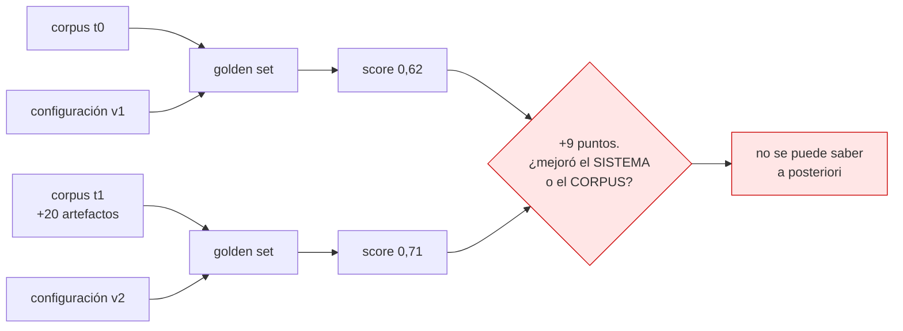
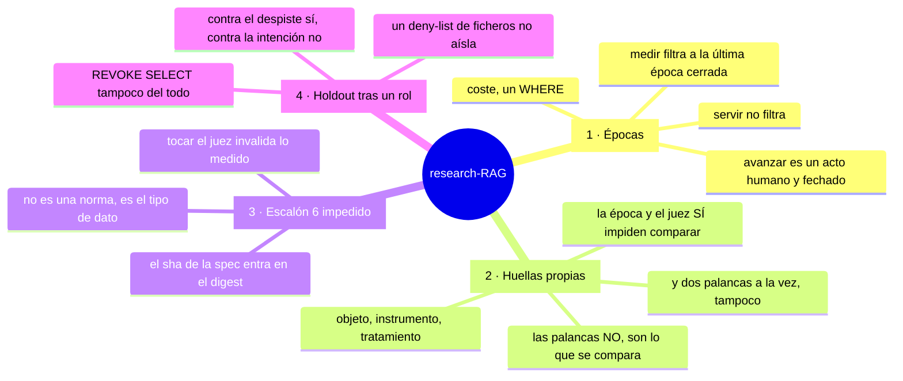
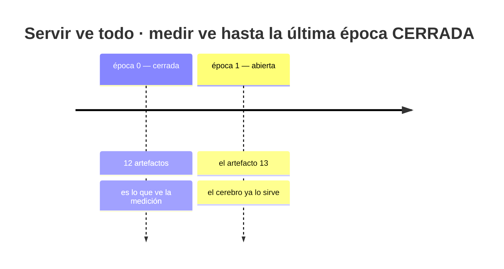
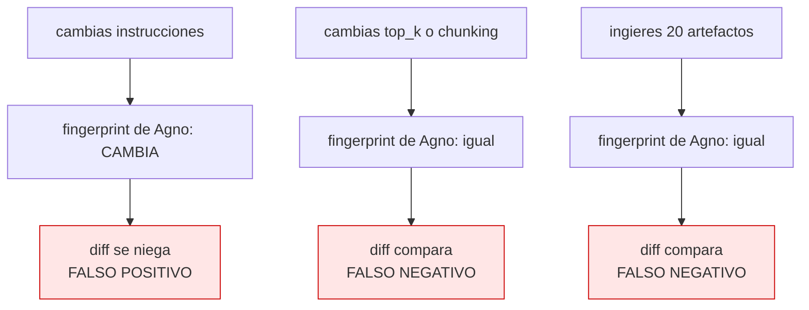
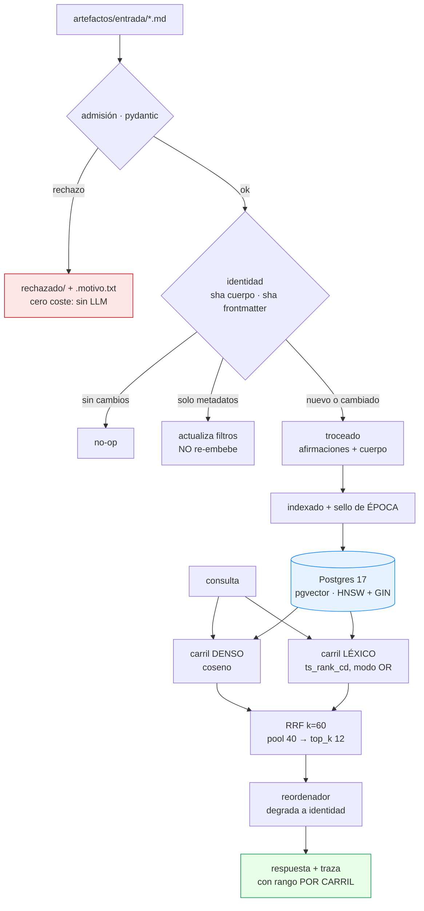
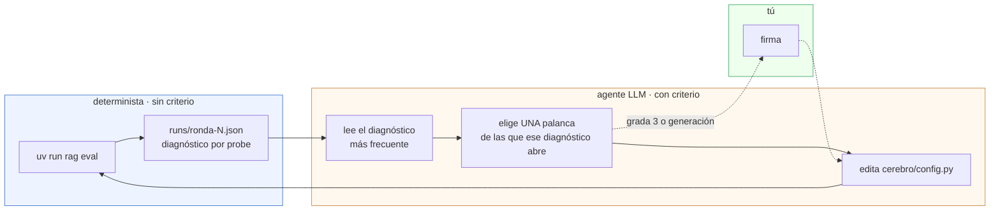

# research-RAG

> Una memoria de I+D sobre Agno, construida al revés: **primero el instrumento
> que mide, después el sistema que se mide**.

[](https://github.com/Jorge-Medina-Diaz/research-RAG/actions/workflows/ci.yml)


## Abstract

Un RAG personal para investigación llega pronto a responder bien la mayoría de
las veces, y ahí se queda. Lo que falta no es una idea brillante: son doscientas
decisiones pequeñas —tamaño del fragmento, número de fragmentos recuperados,
peso entre búsqueda vectorial y léxica, reglas del prompt— que hay que volver a
tomar cada vez que cambia el corpus. Automatizar esas decisiones es un problema
con literatura abundante; el cuello de botella está antes, en la **medición**.

Y hay una tensión que esa literatura no aborda, porque sus bancos de prueba
tienen el corpus congelado: **en una memoria de I+D el corpus crece por
definición, porque es el producto**. Un golden set mide una configuración
*contra un corpus*; si el corpus se mueve, el delta que mides mezcla «el sistema
mejoró» con «añadí el artefacto que respondía a tres probes», y no son
separables a posteriori.

Este repositorio implementa un RAG sobre [Agno](https://agno.com) 2.8.6 cuya
propiedad central es que **la medición se sostiene mientras el corpus crece**,
mediante cuatro mecanismos que se niegan a producir un número cuando ese número
no significaría nada.

> ## El resultado que más importa de este repositorio
>
> **El arnés no detecta que se caiga un carril entero.** Ni que se tire el 70 %
> de los resultados. Se ha medido rompiendo el recuperador a propósito en
> cantidades controladas —`uv run rag mutar`— y ninguna degradación graduada
> supera el suelo de detección.
>
> Y se ha comprobado que **multiplicar el corpus por 3,7 no cambia nada**: la
> sensibilidad depende del número de probes, no del tamaño del corpus.
>
> De paso apareció otra cosa: **apagar el carril denso SUBE el recall**
> (0,815 → 0,830). Con este embedder, el híbrido es peor que el léxico solo. Tres
> mediciones independientes apuntan ahí, y el arnés dice «no se puede saber»
> porque son 3 vuelcos con un suelo de 6. Las dos cosas a la vez.
>
> No es un defecto del arnés: es el tamaño del golden set diciendo lo que puede
> sostener. Con 41 probes sobre 15 artefactos, el bucle **no puede distinguir
> una mejora del ruido en ningún régimen probado**, y cualquier conclusión sobre
> palancas obtenida hasta hoy queda en suspenso.
>
> Es también la razón de que este número exista: casi nadie publica la
> sensibilidad de su eval. Ver
> [el artefacto](artefactos/corpus/2026/el-arnes-no-ve-caerse-un-carril-entero.md)
> y `docs/07-sensibilidad.md`.

**Estado:** la infraestructura de medición está construida y verificada; el
sistema **no ha pasado todavía su propia puerta de calidad**, y eso es
deliberado. Ver [Estado honesto](#estado-honesto).

**Qué es y qué no es.** Es un proyecto **personal y de un solo usuario**,
pensado para correr en un portátil. No es un producto, no tiene despliegue, y
varias decisiones que aquí son correctas serían malas en un sistema
multi-inquilino. Lo que puede tener valor para alguien de fuera no es el
código sino el **método**: cómo se mide un buscador cuyo corpus crece, y qué
hay que negarse a hacer para que el número signifique algo.

---

## Por dónde empezar

| si eres… | empieza por | por qué |
|---|---|---|
| **alguien que no ha construido un RAG** | **[00 · El problema, explicado desde cero](docs/00-el-problema.md)** | No supone nada. Empieza en «tengo cuatrocientas notas» y llega hasta el código, explicando cada concepto al usarlo |
| **alguien que sí, y quiere ver si esto le sirve** | [05 · Una consulta de punta a punta](docs/05-una-traza.md) | Datos reales de una ejecución: qué encontró cada carril, cómo se fusionaron, qué respondió, qué dictaminó el juez |
| **alguien evaluando las decisiones** | [01 · Decisiones](docs/01-decisiones.md) y [02 · Estado del arte](docs/02-estado-del-arte.md) | Siete decisiones con sus alternativas descartadas, y qué se tomó de la literatura frente a qué es extrapolación propia |
| **alguien que va a tocar el código** | [CLAUDE.md](CLAUDE.md) y [03 · Arquitectura](docs/03-arquitectura.md) | El mapa del repositorio y el detalle componente a componente |
| **alguien que tropieza con una palabra** | [99 · Glosario](docs/99-glosario.md) | Cada término con su definición general y qué significa aquí |
| **alguien que quiere saber qué hay construido y qué encendido** | **[06 · Fases 2, 3 y 4](docs/06-fases-2-3-4.md)** | Grafo, comunidades, analogías, topología, GEPA. Siete de nueve **apagadas**, cada una con la medición que lo justifica |

El resto de este README es el resumen. Los cuatro mecanismos de abajo están
explicados con más calma, y suponiendo menos, en el documento 00.

---

## El problema, en un diagrama



La respuesta de este repo no es medir mejor. Es **negarse a dar el número**
cuando la comparación no es legal, y ofrecer un mecanismo barato para que sí lo
sea.

---

## Los cuatro mecanismos

> **Una aclaración de nomenclatura**, porque hay tres listas numeradas en este
> repositorio y confundirlas es fácil. Estos son los **cuatro mecanismos** que
> sostienen la propiedad central. Aparte están las **cuatro decisiones de
> alcance** —qué se construye y qué no— en
> [00 · El problema §3](docs/00-el-problema.md#3--las-cuatro-decisiones-de-dónde-salen),
> y las **siete decisiones de implementación** —cómo funciona por dentro— en
> [01 · Decisiones](docs/01-decisiones.md).



### 1 · Épocas — congelar la vista, no el corpus

La herramienta obvia es hashear el corpus y rechazar la comparación si cambia.
Aplicado aquí eso **mata el bucle**: el hash cambia con cada artefacto, la
comprobación falla siempre, y ninguna comparación es legal jamás. Un detector
que dispara en cada uso está, a efectos prácticos, apagado.



La transcripción de abajo es **real**: es la sesión en la que se escribió el
artefacto número 13 de este repositorio. Los dos `sha` son los de su corpus. Para
reproducirla en un clon limpio, suelta cualquier `.md` nuevo en
`artefactos/entrada/` entre el `avanzar` y el `ingerir` — el corpus que se
distribuye ya lleva los 13 en la época 0, así que el punto de partida es ese.

```console
$ uv run rag eval                                  # línea base
  época 0 · corpus 12 artefactos · sha ab7051da5370
  pasan 18/27   recall@top_k 0.87   p95 0.1s

$ uv run rag epoca avanzar                         # acto humano, fechado
$ uv run rag ingerir                               # el nuevo entra en la época 1
  corpus 13 artefacto(s) · sha 8730bae6dcb6
  época abierta 1 · época de medición 0

$ uv run rag eval
  época 0 · corpus 13 artefactos · sha 8730bae6dcb6  <- el corpus SÍ cambió
  pasan 18/27   recall@top_k 0.87   p95 0.1s         <- la medición NO se movió

$ uv run rag eval --epoca 1 --diff runs/base.json   # y si intentas mezclarlas
  NO COMPARABLE:
    · epoca: 1 != 0 — épocas distintas: el delta mezclaría sistema y corpus
```

### 2 · Tres huellas propias, no las de Agno

`agno.environments` trae un mecanismo de identidad de entorno excelente para
agentes de tareas y **equivocado para un RAG**: su `env_fingerprint` hashea las
instrucciones, pero no el objeto knowledge, ni ningún parámetro de recuperación,
ni el corpus.



Un detector que se equivoca en una sola dirección se aprende. Uno que se
equivoca en las dos se deja de mirar.

Aquí la identidad de registro son tres huellas —`huella_config`, `epoca`,
`huella_juez`— **pero no todas impiden comparar, y esa distinción costó
encontrarla.** La configuración es el *tratamiento*: mover una palanca y
comparar es lo único que hace el bucle, así que negarse ahí lo mataría. Lo que
impide comparar es que cambie el *objeto* (la época, y con ella el corpus
visible) o el *instrumento* (el juez, la spec):

```console
  NO COMPARABLE:
    · epoca: 1 != 0 — épocas distintas: el delta mezclaría sistema y corpus

  Esto no es un aviso, es una negativa.
```

Y una cuarta condición, que no es una huella sino un recuento: dos corridas que
difieren en **dos** palancas son perfectamente comparables y aun así su delta no
se puede atribuir a ninguna. También se niega. La regla «una palanca por ronda»
deja de ser una convención escrita en un fichero y pasa a ser un código de
salida:

```console
$ uv run rag eval --diff runs/base.json         # tras mover top_k
    palanca: top_k  12 → 20
    empeoran 0  ·  mejoran 0  ·  McNemar p=1.0000

$ uv run rag eval --diff runs/base.json         # tras mover también k_rrf
  NO COMPARABLE:
    · 2 palancas movidas a la vez (k_rrf, top_k) — el delta no se puede
      atribuir a ninguna: mueve una y vuelve
```

> Durante su primera versión esta sección decía «se niega si difiere cualquiera
> de las tres», y era falso en el sentido más incómodo: `huella_config` solo
> hasheaba las palancas que obligan a reindexar, así que `top_k` no la cambiaba
> y el mecanismo no disparaba nunca. El código funcionaba **gracias** al fallo.
> Es el mismo defecto que este repositorio le reprocha a Agno cuatro veces, y
> está contado entero en
> [el artefacto que lo documenta](artefactos/corpus/2026/la-configuracion-es-el-tratamiento-no-el-instrumento.md).

### 3 · El escalón 6, impedido por el tipo de dato

De los seis escalones de la escalera de mejora, el sexto —el optimizador o el
juez tocándose a sí mismos— es el único donde el sistema puede subir su nota sin
tocar la calidad: le basta con relajar al juez.

El sha256 de `spec.md` y el de `reglas.py` entran en el `digest()` del scorer, y
el digest entra en la huella del entorno. **El agente puede escribir lo que
quiera; lo que no puede es hacer que su escritura cuente.**

```console
$ # tras editar cerebro/spec.md
$ uv run rag eval --diff runs/base.json
  NO COMPARABLE:
    · huella_juez: 6355caf3e496 != 1d19fb0e54f3 — el juez o la spec cambiaron
```

### 4 · El holdout tras un rol de Postgres — y hasta dónde llega

Una lista de permisos de ficheros no aísla: `Bash(uv:*)` ejecuta Python
arbitrario y con eso se lee cualquier fichero del disco. El holdout vive en un
esquema de Postgres cuyo `SELECT` está revocado para el rol de la aplicación,
que es el que lleva el `DATABASE_URL` del `.env`.

```console
$ python -c "from cerebro.almacen import conexion; ..."
  BLOQUEADO: permission denied for table probes
```

**Y ahora lo que esto NO compra**, porque una versión anterior de esta sección
presentaba el rol como la respuesta al problema del Python arbitrario, y no lo
es. La contraseña del superusuario de Postgres es `ai:ai`, está en
`docker-compose.yml`, en `.env.example` y como valor por defecto en
`cerebro/config.py` — que es precisamente el único fichero que el deny-list
autoriza a editar. Así que:

```python
psycopg.connect("postgresql://ai:ai@localhost:5533/ai")   # una línea, y dentro
```

No hay arreglo local para esto: la base de datos corre en tu máquina y sus
credenciales tienen que estar en algún sitio que tu máquina pueda leer. Un
agente que ejecuta código con tu mismo usuario llega a todo lo que tú llegas.

Lo que la barrera sí compra, y es concreto y limitado:

- El holdout **no está en ningún fichero** que el agente vaya a abrir mientras
  trabaja. Un deny-list sobre `evals/holdout.yaml` se salta sin querer; un
  `REVOKE` hay que rodearlo a propósito.
- El rodeo **deja huella**: escribir una conexión con otra credencial es un acto
  deliberado y visible en el historial, no un `Read` más entre cincuenta.
- Y la credencial del dueño no toca el disco en ningún momento: se pide por
  teclado, con plazo, y no se guarda.

Es una barrera contra el despiste, no contra la intención. El docstring de
`scripts/holdout.py` lo dice desde el primer día; esta sección tardó en decirlo
y por eso está escrito aquí ahora.

---

## Arquitectura



> **El pool es más ancho que lo que se devuelve, a propósito.** Si no lo fuera,
> el reordenador solo podría reordenar, nunca descartar, y no se ganaría su
> latencia.

**`supera: [id]`** en el frontmatter cierra la ventana de validez del artefacto
anterior: sus fragmentos pasan a `vigente: false` y salen de la búsqueda, pero
siguen en la tabla. *No reviertas: invalida.* Escribirlo **es** la firma humana
— la puerta no vive en una interfaz que hay que acordarse de visitar, vive
dentro del artefacto.

---

## El bucle

### Antes del diagrama: quién ejecuta esto

Esta sección daba por sabido algo que no está escrito en ninguna parte del
repositorio, y un lector externo pasó cuatro secciones sin averiguarlo. Así que:

**«El bucle» no es un proceso. Es un agente de código —Claude Code— leyendo
[`CLAUDE.md`](CLAUDE.md) y el comando
[`/mejorar-rag`](.claude/commands/mejorar-rag.md), y editando ficheros.**

El reparto es este, y cada pieza está donde está por un motivo:

| quién | qué hace | por qué ahí |
|---|---|---|
| **`uv run rag eval`** | mide y produce el informe | determinista, sin criterio, reproducible |
| **el agente** | lee el informe, elige **una** palanca, edita `cerebro/config.py`, vuelve a medir | elegir qué palanca abre un diagnóstico es exactamente el trabajo que un `if` no hace bien |
| **tú** | firmas las palancas de grada 3 y todo lo de generación | son las que no se pueden revertir en un minuto, o las que un golden set sintético no sabe ordenar |

Esto explica el resto del README de golpe. Cuando más abajo se habla del
**escalón 6**, del **deny-list**, o de que «una lista de permisos no aísla
porque `Bash(uv:*)` ejecuta Python arbitrario», no es paranoia abstracta: el
optimizador es un LLM con acceso de escritura al repositorio y un objetivo
numérico que subir. Y la vía más barata para subir un número no es mejorar el
sistema, es **relajar al que puntúa**.

Nada de esto supone mala fe. Supone lo de siempre en optimización: un sistema
que puede modificar su propia función objetivo la modificará, porque es el
camino más corto.



### El protocolo de ronda


**Una palanca por ronda.** Si cambias dos y el score sube no sabes cuál
funcionó, y si baja no sabes cuál lo rompió: la atribución causal exige cambios
atómicos.

El juez devuelve **un diagnóstico, no una nota** —`cobertura`, `ordenacion`,
`sintesis`, `prompt`, `ninguno`— y cada uno abre un juego de palancas distinto.
Una nota agregada dice que algo va mal; un diagnóstico dice qué tocar.

---

## Arranque

**Qué necesitas antes:** [Docker](https://docs.docker.com/get-docker/) corriendo
—`rag up` levanta un Postgres 17 con pgvector en el puerto 5533— y
[uv](https://docs.astral.sh/uv/getting-started/installation/), que gestiona
Python 3.12 y las dependencias. Nada más: **ninguna clave de API**.

```bash
git clone https://github.com/Jorge-Medina-Diaz/research-RAG
cd research-RAG
uv run rag up          # Postgres + comprobación. SIN NINGUNA CLAVE.
uv run rag ingerir     # artefactos/entrada/*.md -> corpus
uv run rag eval        # el golden set
```

`rag up` es idempotente: si el contenedor ya está levantado, comprueba y sale.
Si algo falla, lo dice con el motivo — es lo que hace `scripts/verificar.py`, y
también comprueba que la versión de Agno siga siendo 2.8.6.

> En su primera ejecución de verdad, el CI encontró que **este comando no
> existía en un clon limpio**. Faltaba un `[build-system]` en `pyproject.toml`,
> así que uv trataba el proyecto como virtual, no lo instalaba, y
> `[project.scripts]` no creaba nada: `uv run rag up` fallaba con «Failed to
> spawn: rag». En esta máquina funcionaba por estado histórico del `.venv`.
>
> Es el defecto que este repositorio persigue —una afirmación que se lee como
> viva y no lo está— y estaba en la primera línea de las instrucciones de
> arranque. Un badge que nadie comprueba no lo habría visto nunca.

<details>
<summary><b>Y un artefacto de ejemplo, para escribir el primero</b></summary>

Suéltalo en `artefactos/entrada/` y corre `rag ingerir`. Cinco campos
obligatorios; el resto se deriva o es opcional. Si falta uno, el fichero se
mueve a `rechazado/` con un `.motivo.txt` al lado — la carpeta **es** la cola de
errores, y se ve con `ls` sin abrir psql.

```yaml
---
tipo: teardown-repo         # nota-investigacion · teardown-repo · lectura-paper
                            # patron · problema-solucion · decision · benchmark
titulo: Lo que descubrí mirando X por dentro
fecha: 2026-08-12
temas: [rag, postgres]      # vocabulario ABIERTO, sirve para filtrar
dominio: recuperacion       # vocabulario CERRADO: recuperacion · evaluacion
                            # agentes · datos · infraestructura · estadistica
                            # producto · otro

# --- opcionales, pero es donde está casi todo el valor ---
madurez: maduro             # maduro | semi   (borrador se RECHAZA)
confianza: alta             # alta | media | baja
fuentes:                    # obligatorio si tipo es teardown-repo o lectura-paper
  - tipo: repo              # repo · paper · web · sesion · libro
    ref: usuario/repo
    commit: v1.2.3          # obligatorio en un repo: sin commit no es verificable
    acceso: 2026-08-12
afirmaciones:               # lo que el artefacto SOSTIENE, con su estatus
  - texto: La función create() no crea el índice.
    estado: probado         # probado · reportado · extrapolacion · conjetura
  - texto: Con 20k fragmentos esto dejará de ser irrelevante.
    estado: extrapolacion
    verificable_por: >-     # OBLIGATORIO si es extrapolacion: sin forma de
      Medir la latencia p95 a 5k, 20k y 50k fragmentos.
                            # comprobarla sería una conjetura, y ese es otro estado
supera: [2026-05-02-nota-vieja]   # cierra la ventana de validez de la otra
relacionado_con: [2026-08-12-otra-nota]
---

El cuerpo, en Markdown. Se trocea y se indexa junto con las afirmaciones, que
van por delante para que un símbolo que solo aparece en el frontmatter siga
siendo buscable.
```

Los doce artefactos de [`artefactos/corpus/2026/`](artefactos/corpus/2026/) son
ejemplos reales y ya ingeridos: todos documentan hallazgos de la construcción de
este mismo repositorio.

</details>

El sistema arranca **entero sin claves de API**. Los embeddings en modo `mock`
son pseudo-vectores derivados de SHA-256: deterministas, sin significado
semántico, pero suficientes para que el pipeline completo funcione y para que la
señal determinista corra en CI.

Y hay un tercer modo, `falso`, que levanta un guion que habla el protocolo de
OpenAI —incluido SSE, que es el que usa el motor de rollouts— y permite correr
el **nivel completo** sin claves: tool calls, `output_schema` del juez,
extracción de `references`, scorer y rollouts.

```bash
uv run rag falso       # en otra terminal, y LLM_PROVIDER=falso en .env
uv run rag eval        # ahora corre el nivel completo
```

<details>
<summary><b>Todos los comandos</b></summary>

```
uv run rag up          base de datos + comprobación
uv run rag ingerir     ingesta. --recrear reindexa el corpus entero
uv run rag serve       AgentOS en :7788, con la ruta de voto
uv run rag falso       modelo guionizado en :7799
uv run rag eval        el golden set
       --nivel0        solo recuperación: cero llamadas a LLM
       --ruido         5 corridas idénticas -> σ
       --solo IDS      re-ejecuta solo lo que falló
       --diff FICHERO  compara, o se niega
uv run rag epoca       estado. `avanzar` cierra la abierta
uv run rag calibrar    --preparar / --comparar
uv run rag holdout     --instalar / --probar / --anadir / --correr
uv run rag sesiones    vuelca el tráfico real
uv run rag grafo       construye el grafo de artefactos y lo describe
uv run rag comunidades detecta comunidades. --resumir gasta LLM
uv run rag analogias   la cola cross-dominio. --minar propone
uv run rag topologia   puentes, agujeros y deriva. Cero llamadas
uv run rag ajeno       ingiere un corpus que NO escribiste tú (Agno, offline)
uv run rag puerta      dónde está la puerta 0. --sigma la mide gratis
uv run rag mutar       rompe el recuperador a propósito y mide qué ve el arnés
uv run rag disparadores  ¿qué costura pide construirse? Por recall, y con
                       la cobertura del golden set al lado
uv run rag propuestas  todo lo que espera tu firma
uv run rag gepa        evolución de instrucciones. Propone; no aplica
uv run rag jobs        --nocturno (gratis) · --mensual (gasta)
uv run rag traza       una consulta de punta a punta. Genera docs/05
uv run rag verificar   comprueba el entorno y la versión de Agno
uv run rag test        145 tests. Sin red, sin claves, sin base de datos.
```

</details>

---

## Documentación

| | | supone |
|---|---|---|
| **[00 · El problema](docs/00-el-problema.md)** | **Empieza aquí.** Qué es un RAG, por qué hay que medirlo, de dónde sale cada decisión de alcance | **nada** |
| [01 · Decisiones](docs/01-decisiones.md) | Siete decisiones de implementación, con contexto, alternativas descartadas y consecuencias | el 00 |
| [02 · Estado del arte](docs/02-estado-del-arte.md) | Qué existe, qué se tomó, qué se descartó y por qué. Con referencias | el 00 |
| [03 · Arquitectura](docs/03-arquitectura.md) | El detalle técnico, componente a componente | el 00 |
| [04 · La medición](docs/04-medicion.md) | Spec, reglas, juez, épocas y estadística | el 00 |
| **[06 · Fases 2, 3 y 4](docs/06-fases-2-3-4.md)** | Grafo, comunidades, analogías, topología, GEPA. **Construidas y apagadas**, con la medición de cada una | el 00 |
| **[05 · Una traza](docs/05-una-traza.md)** | Una consulta real de punta a punta, generada por `rag traza` | poco |
| [99 · Glosario](docs/99-glosario.md) | Cada término, con su definición general y qué significa aquí | nada |
| [CLAUDE.md](CLAUDE.md) | Mapa del repo para agentes de código | el 03 |

---

## Estado honesto

**Verificado corriendo:**

| | |
|---|---|
| `rag up` en limpio, sin claves | Postgres 17 + pgvector, preflight en verde |
| Ingesta → índice → recuperación | 14 artefactos, HNSW y GIN creados a mano porque Agno no los crea |
| Carril de grafo, medido | Encendido sube el recall de 0,85 a 0,89 y **baja `multi_hop` de 3/7 a 2/7**. El diff: 4 peor, 5 mejor, 1 neto, suelo de detección 6. **No se puede saber**, y el carril se queda apagado |
| Comunidades | 3 sobre 14 artefactos, modularidad 0,350. Pesar las aristas por rareza del tema (IDF) la subió desde 0,240 y la cruzó por encima del umbral de significación |
| Épocas, el aviso que faltaba | Medir contra una época **abierta** no está congelado, y el arnés no lo decía. Ahora avisa: me pasó en mi propio repo y el recall se movió al ingerir |
| Fusión de carriles | Los dos vivos. En la [traza](docs/05-una-traza.md) hay fragmentos que entran sin ser primeros en ningún carril, por acuerdo entre los dos. **Con 60 fragmentos y 30 por carril esto no demuestra que el híbrido funcione** —cada carril ve la mitad del corpus—; demuestra que la fusión hace la aritmética que dice hacer |
| Nivel completo contra el guion | El arnés procesa las 41 sin romperse. **Pasan 14 de 41.** El guion responde siempre, así que las de `fuera_de_alcance` fallan a propósito; el resto son fallos de verdad. El desglose por categoría y por diagnóstico está en `runs/completo.json`, que es la fuente — esta fila se ha equivocado dos veces por transcribirlo a mano |
| Reproducción a k=3 | Todas las violaciones de R2 y R4 se confirman al re-correrlas a k=3; ninguna era espuria. Las cifras exactas, en `runs/completo.json` |
| Determinismo del arnés | Tres corridas completas seguidas devuelven **el mismo conjunto exacto** de 18 probes aprobadas. Lo que se mide contra el guion es la fontanería, y la fontanería no tiembla |
| Tocar la spec → comparar | **NO COMPARABLE** |
| Cruzar épocas → comparar | **NO COMPARABLE** — y verificado de punta a punta: avanzar la época, ingerir un artefacto 13.º y volver a medir da **el mismo 15/27 con el mismo recall 0,85** mientras el sha del corpus cambia |
| Suelos en nivel completo | Los cinco se comprueban: recall 0,85 sobre 27 probes · R6 1,00 sobre 3 · R2 y R4 **ROTOS** con 10 y 13 violaciones confirmadas a k=3 · R5 en 0 |
| Mover **una** palanca → comparar | comparable, y el informe **nombra** la palanca: `top_k 12 → 20` |
| Mover **dos** palancas → comparar | **NO COMPARABLE**: el delta no se puede atribuir a ninguna |
| `SELECT` al holdout desde Python arbitrario | **permission denied** |
| Tests / ruff / diagramas / enlaces | **145 pasan**, de los que **17 prueban COSTURAS** y no piezas / limpio / 31 de 31 mermaid / 50 de 50 enlaces. Los cuatro, comprobados en CI |

**No hecho, y es lo que decide si esto sirve:**

- **No se ha corrido contra un modelo real.** La fontanería está verificada de
  punta a punta; la calidad no.
- **α no está medido.** La puerta de la Fase 0 sigue cerrada. Contra un guion
  determinista no hay nada que calibrar.
- **σ no está medido de verdad.** El mecanismo da `0,0000` contra el guion, que
  es determinista por construcción. Valida la tubería y no dice nada del ruido
  real, que es varianza del modelo y del juez.
- **El suelo primario vuelve a pasar** (recall 0.87 ≥ 0,85) y llegó a romperse
  por 0,0167 cuando una sola probe mueve 0,0185 — **por menos de lo que el
  instrumento distingue**. El arnés lo dijo al lado del número en vez de bajar
  la portería, y esa comprobación se queda. Lo que lo arregló no fue afinar
  nada: fue descubrir que `metadatos_prepend`, una palanca de GRADA 3, no
  anteponía nada desde el primer día.
- **Siete de las nueve piezas de las fases 2, 3 y 4 están apagadas.** Están
  construidas y probadas; encenderlas depende de una medición que todavía no
  las justifica. El detalle de cada una en [06](docs/06-fases-2-3-4.md).
- **El golden set son 41 probes sobre 14 artefactos**, y los catorce son del propio
  desarrollo, no material de investigación real.
- **Cero tráfico real**, así que el golden set es 100 % sintético. Consecuencia
  ineludible: **el bucle solo puede mover palancas de recuperación**; las de
  generación las propone y las firma una persona.
- **El sesgo del post-filtrado por época sobre el ANN no está medido**, solo
  acotado por diseño.
- **La barrera del holdout no resiste Python arbitrario.** El rol de Postgres
  es real y la negativa está verificada, pero la contraseña del superusuario
  viaja en el repositorio. Qué compra exactamente y qué no está
  [en su sección](#4--el-holdout-tras-un-rol-de-postgres--y-hasta-dónde-llega).
- **`cerebro/spec.md` tiene dos afirmaciones falsas** —dice 30 probes cuando hay
  41, y promete una comprobación por código para R6 que `reglas.py` no
  implementa— y está congelada por hash. Corregirla invalida toda medición
  anterior, así que es una firma humana pendiente, no un `sed`. Es también un
  defecto del método: congelar un documento en prosa **garantiza** que se pudra.
- No hay grafo, ni comunidades, ni analogías cross-dominio. Están diseñadas como
  costuras con su trigger explícito, y el trigger es una categoría del golden
  set cayendo, no una corazonada.

**Deuda conocida:** `evals/correr.py` (587 líneas) hace demasiado; el
reordenador está escrito y nunca se ha ejecutado; y `scripts/` + `tareas.py`
van 400 líneas por encima de su presupuesto, anotado en `CLAUDE.md`.

---

## Cuatro defectos de Agno 2.8.6 que este repo esquiva

Verificados leyendo el paquete instalado, no la documentación. Los cuatro son de
la misma familia —**un parámetro que se lee como vivo y no lo está**— y ninguno
lanza un error.

| | Defecto | Dónde |
|---|---|---|
| 1 | **`PgVector.create()` no crea el índice HNSW ni el GIN.** Solo `optimize()`, y nada en `agno/knowledge/` ni en `agno/vectordb/pgvector/` lo llama — el único llamador del paquete es `singlestore.py:116`. Sin crearlos a mano, `hnsw_m` es una palanca sobre un índice inexistente | `pgvector.py:226` |
| 2 | **`_create_gin_index` interpola `content_language` sin comillas**: con `spanish` emite `to_tsvector(spanish, content)`, que Postgres resuelve como columna, y falla | `pgvector.py:1462` |
| 3 | **`hybrid_search` tiene su predicado `@@` comentado**, así que escanea la tabla entera; y fusiona con una suma lineal de un coseno y un `ts_rank_cd`, dos escalas incomparables cuyo peso es un tipo de cambio | `pgvector.py:1157` |
| 4 | **`env_fingerprint` es ciego al corpus y a la recuperación** | `environments/environment.py:295` |

> Si subes de versión de Agno, comprueba los cuatro. `rag verificar` avisa
> cuando la versión no es 2.8.6 y nombra qué revisar.

---

## Tres repos que el código menciona y que no vas a poder abrir

Los comentarios citan tres proyectos anteriores míos, **privados**, para dejar
constancia de dónde sale cada decisión. No hacen falta para nada: el repo es
autocontenido. Pero si te preguntas qué son:

| | |
|---|---|
| **CVs-SaaS** | Un RAG anterior de 51k LOC con grafo bi-temporal sobre Apache AGE, retriever de cinco carriles y motor de coherencia. De ahí salen las piezas extraídas —RRF, el protocolo de reordenador, el proveedor determinista de embeddings— y, sobre todo, **las cicatrices**: cada «esto no se hace así» del código apunta a algo que allí se rompió |
| **atlas-rai** | La implementación de referencia del bucle de auto-mejora, 966 líneas. Este repo calca su esqueleto —spec, palancas por grada, juez con diagnóstico, permisos como gobernanza— y lo escala a un corpus que crece |
| **rag-glue** | Un paquete de medición sin dependencias. De ahí vienen la identidad de corrida por huellas y la regla «si no capturas el score en el instante de la búsqueda, no existe» |

Cuando el código dice *«atlas-rai tiene este defecto por defecto»* o *«el
`try/except` que en CVs-SaaS convertía el COMMIT en un ROLLBACK silencioso»*, es
literal: son fallos medidos, no hipótesis.

## Créditos

Tres capas, y conviene no confundirlas:

1. **La distinción RAI / RSI y los cinco requisitos de un sistema auto-mejorante**
   vienen de [Ashpreet Bedi](https://www.ashpreetbedi.com/recursive-auto-improvement).
2. **El vocabulario operativo** —gradas, fases con puertas, la escalera de
   escalones, el juez que devuelve diagnóstico en vez de nota, «una palanca por
   ronda», los suelos duros, «no reviertas: invalida»— es de la serie de entradas
   del autor de este repositorio, escrita sobre lo anterior. Cuando este README
   dice «la doctrina», se refiere a eso.
3. **La extensión al caso del corpus vivo** —las épocas, la separación entre
   objeto, instrumento y tratamiento, la caducidad ruidosa de probes, la
   separación entre lo que el bucle mueve solo y lo que firma una persona— es
   propia de este proyecto y **no está validada en ningún benchmark publicado**.

Una versión anterior de esta sección atribuía la capa 2 a la 1, y la sección
final de [02 · Estado del arte](docs/02-estado-del-arte.md) la atribuía al autor:
las dos no podían ser ciertas, y lo señaló un lector externo.

Construido sobre [Agno](https://github.com/agno-agi/agno).

## Licencia

[MIT](LICENSE).
