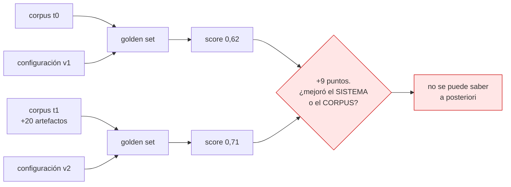
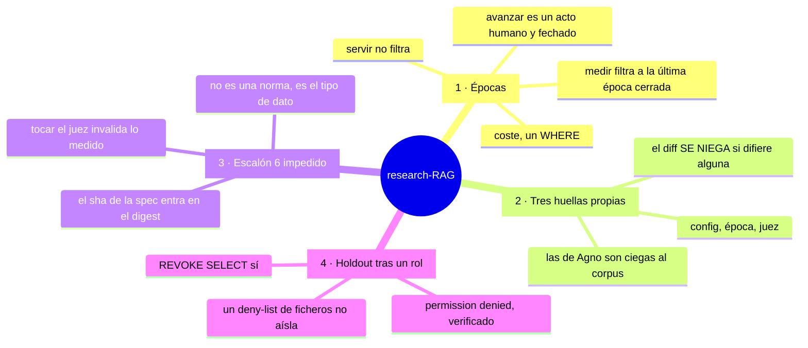
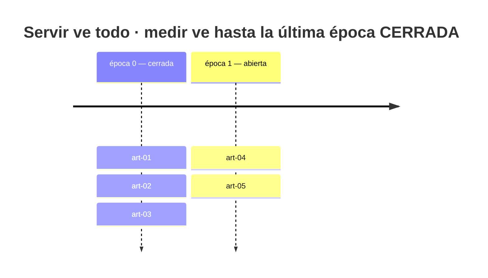
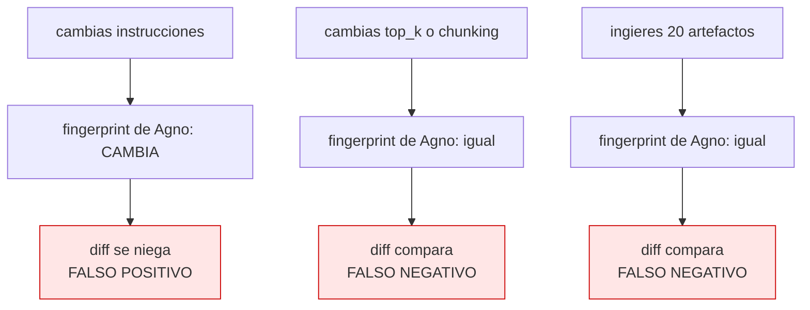
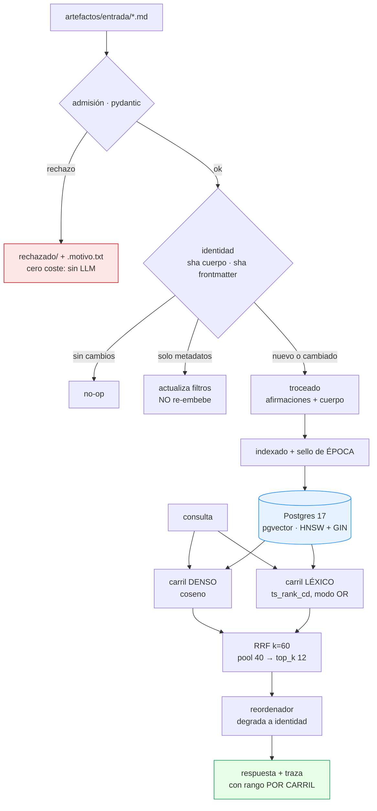
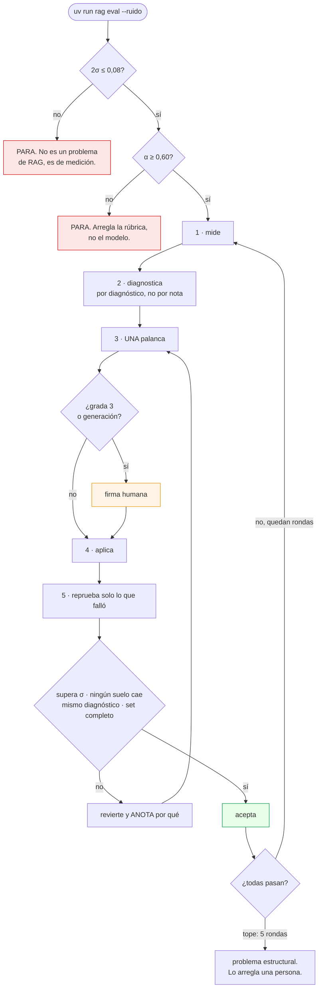

# research-RAG

> Una memoria de I+D sobre Agno, construida al revés: **primero el instrumento
> que mide, después el sistema que se mide**.


## Abstract

Un RAG personal para investigación llega pronto a responder bien la mayoría de
las veces, y ahí se queda. Lo que falta no es una idea brillante: son doscientas
decisiones pequeñas —tamaño del fragmento, número de fragmentos recuperados,
peso entre búsqueda vectorial y léxica, reglas del prompt— que hay que volver a
tomar cada vez que cambia el corpus. Automatizar esas decisiones es un problema
con literatura abundante; el cuello de botella está antes, en la **medición**.

Y hay una tensión que esa literatura no aborda, porque sus bancos de prueba
tienen el corpus congelado: **en una memoria de I+D el corpus crece por
definición, porque es el producto**. Un golden set mide una configuración
*contra un corpus*; si el corpus se mueve, el delta que mides mezcla «el sistema
mejoró» con «añadí el artefacto que respondía a tres probes», y no son
separables a posteriori.

Este repositorio implementa un RAG sobre [Agno](https://agno.com) 2.8.6 cuya
propiedad central es que **la medición se sostiene mientras el corpus crece**,
mediante cuatro mecanismos que se niegan a producir un número cuando ese número
no significaría nada.

**Estado:** la infraestructura de medición está construida y verificada; el
sistema **no ha pasado todavía su propia puerta de calidad**, y eso es
deliberado. Ver [Estado honesto](#estado-honesto).

---

## El problema, en un diagrama



La respuesta de este repo no es medir mejor. Es **negarse a dar el número**
cuando la comparación no es legal, y ofrecer un mecanismo barato para que sí lo
sea.

---

## Las cuatro decisiones



### 1 · Épocas — congelar la vista, no el corpus

La herramienta obvia es hashear el corpus y rechazar la comparación si cambia.
Aplicado aquí eso **mata el bucle**: el hash cambia con cada artefacto, la
comprobación falla siempre, y ninguna comparación es legal jamás. Un detector
que dispara en cada uso está, a efectos prácticos, apagado.



```console
$ uv run rag ingerir            # el artefacto nuevo entra en la época 1
$ uv run rag eval
  época 0  ·  corpus 4 artefactos · sha eb94ec7b       <- el corpus SÍ cambió
  pasan 6/8   recall@top_k 1.00                        <- la medición NO se movió
```

### 2 · Tres huellas propias, no las de Agno

`agno.environments` trae un mecanismo de identidad de entorno excelente para
agentes de tareas y **equivocado para un RAG**: su `env_fingerprint` hashea las
instrucciones, pero no el objeto knowledge, ni ningún parámetro de recuperación,
ni el corpus.



Un detector que se equivoca en una sola dirección se aprende. Uno que se
equivoca en las dos se deja de mirar. Aquí la identidad de registro es
`huella_config` + `epoca` + `huella_juez`, y `eval --diff` **se niega** si
difiere cualquiera de las tres:

```console
  NO COMPARABLE:
    · epoca: 1 != 0 — épocas distintas: el delta mezclaría sistema y corpus

  Esto no es un aviso, es una negativa.
```

### 3 · El escalón 6, impedido por el tipo de dato

De los seis escalones de la escalera de mejora, el sexto —el optimizador o el
juez tocándose a sí mismos— es el único donde el sistema puede subir su nota sin
tocar la calidad: le basta con relajar al juez.

El sha256 de `spec.md` y el de `reglas.py` entran en el `digest()` del scorer, y
el digest entra en la huella del entorno. **El agente puede escribir lo que
quiera; lo que no puede es hacer que su escritura cuente.**

```console
$ # tras editar cerebro/spec.md
$ uv run rag eval --diff runs/base.json
  NO COMPARABLE:
    · huella_juez: 6355caf3e496 != 1d19fb0e54f3 — el juez o la spec cambiaron
```

### 4 · El holdout tras un rol de Postgres

Una lista de permisos de ficheros no aísla: `Bash(uv:*)` ejecuta Python
arbitrario y con eso se lee cualquier fichero del disco. El holdout vive en un
esquema de Postgres cuyo `SELECT` está revocado para el rol de la aplicación.

```console
$ python -c "from cerebro.almacen import conexion; ..."
  BLOQUEADO: permission denied for table probes
```

---

## Arquitectura



> **El pool es más ancho que lo que se devuelve, a propósito.** Si no lo fuera,
> el reordenador solo podría reordenar, nunca descartar, y no se ganaría su
> latencia.

**`supera: [id]`** en el frontmatter cierra la ventana de validez del artefacto
anterior: sus fragmentos pasan a `vigente: false` y salen de la búsqueda, pero
siguen en la tabla. *No reviertas: invalida.* Escribirlo **es** la firma humana
— la puerta no vive en una interfaz que hay que acordarse de visitar, vive
dentro del artefacto.

---

## El bucle



**Una palanca por ronda.** Si cambias dos y el score sube no sabes cuál
funcionó, y si baja no sabes cuál lo rompió: la atribución causal exige cambios
atómicos.

El juez devuelve **un diagnóstico, no una nota** —`cobertura`, `ordenacion`,
`sintesis`, `prompt`, `ninguno`— y cada uno abre un juego de palancas distinto.
Una nota agregada dice que algo va mal; un diagnóstico dice qué tocar.

---

## Arranque

```bash
git clone https://github.com/Jorge-Medina-Diaz/research-RAG
cd research-RAG
uv run rag up          # Postgres + comprobación. SIN NINGUNA CLAVE.
uv run rag ingerir     # artefactos/entrada/*.md -> corpus
uv run rag eval        # el golden set
```

El sistema arranca **entero sin claves de API**. Los embeddings en modo `mock`
son pseudo-vectores derivados de SHA-256: deterministas, sin significado
semántico, pero suficientes para que el pipeline completo funcione y para que la
señal determinista corra en CI.

Y hay un tercer modo, `falso`, que levanta un guion que habla el protocolo de
OpenAI —incluido SSE, que es el que usa el motor de rollouts— y permite correr
el **nivel completo** sin claves: tool calls, `output_schema` del juez,
extracción de `references`, scorer y rollouts.

```bash
uv run rag falso       # en otra terminal, y LLM_PROVIDER=falso en .env
uv run rag eval        # ahora corre el nivel completo
```

<details>
<summary><b>Todos los comandos</b></summary>

```
uv run rag up          base de datos + comprobación
uv run rag ingerir     ingesta. --recrear reindexa el corpus entero
uv run rag serve       AgentOS en :7788, con la ruta de voto
uv run rag falso       modelo guionizado en :7799
uv run rag eval        el golden set
       --nivel0        solo recuperación: cero llamadas a LLM
       --ruido         5 corridas idénticas -> σ
       --solo IDS      re-ejecuta solo lo que falló
       --diff FICHERO  compara, o se niega
uv run rag epoca       estado. `avanzar` cierra la abierta
uv run rag calibrar    --preparar / --comparar
uv run rag holdout     --instalar / --probar / --anadir / --correr
uv run rag sesiones    vuelca el tráfico real
uv run rag test        83 tests. Sin red, sin claves, sin base de datos.
```

</details>

---

## Documentación

| | |
|---|---|
| [Decisiones clave](docs/01-decisiones.md) | Siete decisiones con su contexto, alternativas descartadas y consecuencias |
| [Estado del arte](docs/02-estado-del-arte.md) | Qué existe, qué se tomó, qué se descartó y por qué |
| [Arquitectura](docs/03-arquitectura.md) | El detalle técnico, componente a componente |
| [La medición](docs/04-medicion.md) | Spec, reglas, juez, épocas y estadística |
| [CLAUDE.md](CLAUDE.md) | Mapa del repo para agentes de código |

---

## Estado honesto

**Verificado corriendo:**

| | |
|---|---|
| `rag up` en limpio, sin claves | Postgres 17 + pgvector, preflight en verde |
| Ingesta → índice → recuperación | 3 artefactos, 15 fragmentos, HNSW y GIN creados |
| Fusión de carriles | `{denso: 11, lexico: 1}` → RRF lo pone primero |
| Nivel completo contra el guion | 21/21 probes atraviesan el arnés |
| Reproducción a k=3 | 11 R2 y 6 R4 confirmadas |
| Tocar la spec → comparar | **NO COMPARABLE** |
| Cruzar épocas → comparar | **NO COMPARABLE** |
| `SELECT` al holdout desde Python arbitrario | **permission denied** |
| Tests / ruff | 83 pasan / limpio |

**No hecho, y es lo que decide si esto sirve:**

- **No se ha corrido contra un modelo real.** La fontanería está verificada de
  punta a punta; la calidad no.
- **α no está medido.** La puerta de la Fase 0 sigue cerrada. Contra un guion
  determinista no hay nada que calibrar.
- **σ no está medido de verdad.** El mecanismo da `0,0000` contra el guion, que
  es determinista por construcción. Valida la tubería y no dice nada del ruido
  real, que es varianza del modelo y del juez.
- **El golden set son 21 probes sobre 3 artefactos**, y los tres son del propio
  desarrollo, no material de investigación real.
- **Cero tráfico real**, así que el golden set es 100 % sintético. Consecuencia
  ineludible: **el bucle solo puede mover palancas de recuperación**; las de
  generación las propone y las firma una persona.
- **El sesgo del post-filtrado por época sobre el ANN no está medido**, solo
  acotado por diseño.
- No hay grafo, ni comunidades, ni analogías cross-dominio. Están diseñadas como
  costuras con su trigger explícito, y el trigger es una categoría del golden
  set cayendo, no una corazonada.

**Deuda conocida:** `evals/correr.py` (~480 líneas) hace demasiado; el
reordenador está escrito y nunca se ha ejecutado.

---

## Cuatro defectos de Agno 2.8.6 que este repo esquiva

Verificados leyendo el paquete instalado, no la documentación. Los cuatro son de
la misma familia —**un parámetro que se lee como vivo y no lo está**— y ninguno
lanza un error.

| | Defecto | Dónde |
|---|---|---|
| 1 | **`PgVector.create()` no crea el índice HNSW ni el GIN.** Solo `optimize()`, y nada en `agno/knowledge/` ni en `agno/vectordb/pgvector/` lo llama — el único llamador del paquete es `singlestore.py:116`. Sin crearlos a mano, `hnsw_m` es una palanca sobre un índice inexistente | `pgvector.py:226` |
| 2 | **`_create_gin_index` interpola `content_language` sin comillas**: con `spanish` emite `to_tsvector(spanish, content)`, que Postgres resuelve como columna, y falla | `pgvector.py:1462` |
| 3 | **`hybrid_search` tiene su predicado `@@` comentado**, así que escanea la tabla entera; y fusiona con una suma lineal de un coseno y un `ts_rank_cd`, dos escalas incomparables cuyo peso es un tipo de cambio | `pgvector.py:1157` |
| 4 | **`env_fingerprint` es ciego al corpus y a la recuperación** | `environments/environment.py:295` |

> Si subes de versión de Agno, comprueba los cuatro. `rag verificar` avisa
> cuando la versión no es 2.8.6 y nombra qué revisar.

---

## Créditos

El marco conceptual —RAI frente a RSI, gradas, fases, puertas, la escalera de
escalones, el juez que devuelve diagnóstico— viene del trabajo de
[Ashpreet Bedi](https://www.ashpreetbedi.com/recursive-auto-improvement) sobre
auto-mejora recursiva de agentes. La extensión al caso del **corpus vivo** —las
épocas, la tercera huella, la caducidad de probes— es propia y **no está
validada en ningún benchmark publicado**.

Construido sobre [Agno](https://github.com/agno-agi/agno).

## Licencia

[MIT](LICENSE).
