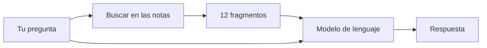
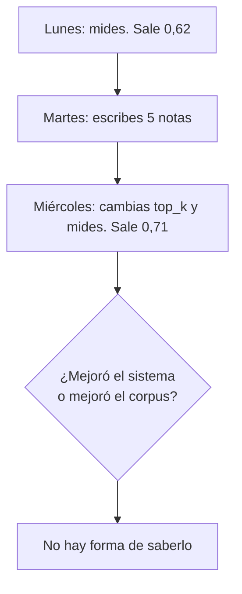

# El problema, explicado desde cero

Este documento no supone que sepas qué es un RAG, ni qué es RRF, ni por qué
alguien querría medir un buscador. Empieza por el problema y llega hasta el
código. Si algo aquí te suena a jerga, está en el [glosario](99-glosario.md).

Los otros documentos suponen que has leído este.

---

## 1 · La situación

Trabajas en I+D. Cada semana produces cosas como estas:

- lees un repositorio con detalle y anotas cómo funciona por dentro,
- lees un paper y te quedas con tres números,
- resuelves un problema que te costó una tarde y escribes por qué,
- tomas una decisión técnica y anotas qué descartaste.

Al cabo de un año tienes cuatrocientas notas. Y entonces pasa esto:

> «Yo esto ya lo miré. ¿Dónde lo escribí?»

Y peor:

> «Esto que estoy investigando ahora se parece a algo que vi hace ocho meses,
> pero no recuerdo a qué.»

La primera pregunta la resuelve un buscador. La segunda no: para responderla
haría falta que el sistema notara un parecido que tú no has notado.

Este proyecto ataca la primera y deja la segunda **diseñada y sin construir**,
con un criterio explícito para cuándo construirla. El motivo está en la
sección 8.

---

## 2 · Qué es un RAG, en cuatro frases

Un modelo de lenguaje no sabe lo que hay en tus notas. Puedes pegarle las
notas en la conversación, pero cuatrocientas notas no caben.

**RAG** —*Retrieval-Augmented Generation*, generación aumentada por
recuperación— es el apaño obvio: antes de preguntarle al modelo, **busca** los
cinco o diez fragmentos de tus notas que parecen relevantes, y **pégaselos** en
la pregunta. El modelo responde leyendo solo eso.



Todo el problema está en la caja «Buscar». Si trae los fragmentos que no son,
el modelo responde con confianza usando material equivocado, y eso se parece
mucho a una respuesta correcta.

### Cómo se busca: los dos carriles

Hay dos maneras de buscar texto y las dos fallan en sitios distintos.

**Búsqueda densa (o semántica, o vectorial).** Un modelo convierte cada
fragmento en una lista de números —un **embedding**, típicamente 1.536 de
ellos— colocada de forma que textos con significado parecido queden cerca.
Buscar es convertir tu pregunta en su lista de números y devolver los
fragmentos más cercanos.

Es buena entendiendo que «cómo evito que el índice se quede obsoleto» y «¿cuándo
hay que reindexar?» son la misma pregunta. Es **mala** con nombres propios y
símbolos: `MismatchError`, `ef_construction`, `2.8.6`. Un embedding aplasta esos
tokens raros contra sus vecinos y el resultado es que buscas un símbolo exacto y
te devuelve algo temáticamente cercano.

**Búsqueda léxica (o de texto completo).** La de toda la vida: qué documentos
contienen estas palabras. Postgres la trae de serie. Es exacta con símbolos y
torpe con sinónimos.

Las dos juntas cubren lo que la otra falla. La pregunta es **cómo se mezclan**,
y la respuesta —RRF— está en la sección 4, porque hace falta antes entender qué
se decidió construir y qué no.

---

## 3 · Las cuatro decisiones, de dónde salen

Este proyecto arrancó con cuatro decisiones tomadas antes de escribir código.
En la primera versión de esta documentación aparecían como una tabla de cuatro
filas sin explicación. Eso era exactamente lo que no había que hacer, y un
lector externo lo señaló. Aquí va cada una con su porqué.

### Decisión 1 · Fase 0 + Fase 1, y las demás diseñadas sin construir

**Qué significa.** El proyecto tiene cinco fases posibles, de la 0 a la 4. La 0
es *saber medir*. La 1 es *un bucle que mueve parámetros y comprueba si mejoró*.
De la 2 en adelante entran cosas más ambiciosas: grafos de conocimiento,
detección de comunidades, analogías entre temas distintos. **Solo se construyen
la 0 y la 1.**

**De dónde sale.** De un proyecto anterior del autor: un RAG de 51.000 líneas
con grafo bi-temporal, cinco carriles de recuperación y motor de coherencia.
Tenía todo lo de la fase 3. Y **cero arnés de evaluación**. Cuando algo iba mal
no había forma de saber si el problema era el grafo, el reranker o el prompt,
porque no había ningún número contra el que comparar.

La lección no es «los grafos son malos». Es que **construir la capacidad antes
que la medición te deja sin manera de saber si la capacidad sirve**.

**Por qué tiene sentido.** Cada costura no construida —el carril de grafo, las
comunidades, las analogías— tiene un **disparador escrito**: una categoría
concreta del conjunto de pruebas cayendo por debajo de un número concreto. Por
ejemplo, el carril de grafo se construye si las preguntas de tipo `multi_hop`
bajan de 0,60 después de agotar los ajustes baratos.

Eso convierte «¿hace falta un grafo?» de una discusión de sobremesa en una
consulta a un fichero JSON.

> **El riesgo real de esta decisión**, dicho por delante: un disparador que
> nunca se comprueba es lo mismo que no tener disparador. Si nadie corre el
> conjunto de pruebas cada semana, las costuras se quedan sin construir por
> inercia y no por criterio.

### Decisión 2 · Contrato estricto en la entrada, con normalizador

**Qué significa.** Para entrar al corpus, un fichero tiene que traer una
cabecera YAML con cinco campos obligatorios. Si le falta uno, **se rechaza** y
se escribe el motivo en un fichero al lado. Un agente rellena lo que se puede
derivar y lo marca como derivado.

```yaml
---
tipo: teardown-repo          # de siete valores posibles
titulo: ...                  # texto
fecha: 2026-08-12
temas: [agno, pgvector]      # vocabulario abierto
dominio: recuperacion        # vocabulario CERRADO, de ocho valores
---
```

**De dónde sale.** De dos sitios. Uno: en el proyecto anterior, la ingesta
aceptaba casi cualquier cosa y descartaba en silencio de tres formas distintas,
sin cola de errores. Cuando un documento no aparecía en las búsquedas, no había
manera de saber si nunca entró o si entró mal.

Dos: de una observación sobre metadatos. **Un metadato que no capturaste en la
ingesta no se rellena después sin releerlo todo.** Si dentro de seis meses
quieres filtrar por `dominio` y no lo pediste desde el primer día, tienes que
volver a abrir cuatrocientos ficheros.

**Por qué `dominio` es un vocabulario cerrado y `temas` no.** No es capricho.
`temas` sirve para filtrar y puede crecer libremente. `dominio` sirve para algo
que `temas` no puede: definir «contextos dispares» de forma computable. La
minería de analogías —la costura de la fase 3— necesita poder preguntar
`a.dominio != b.dominio`. Sin un eje cerrado, eso no es una consulta: es una
intuición.

**Por qué se rechaza en vez de avisar.** Porque un aviso en un log es un aviso
que nadie lee. La carpeta de entrada con el fichero rechazado y su `.motivo.txt`
al lado **es** la cola de errores, y se ve con `ls`.

### Decisión 3 · Solo local, con `docker compose`

**Qué significa.** Postgres en un contenedor, todo en tu máquina, ningún
servicio gestionado, ningún despliegue.

**De dónde sale.** De contar los usuarios: uno. Todo lo que un SaaS
multi-inquilino necesita —aislamiento por filas, migraciones versionadas,
outbox de eventos, autenticación— aquí no lo paga nadie. El proyecto anterior
tenía 42 migraciones y quince contextos delimitados porque los necesitaba;
copiarlos aquí sería copiar la factura sin el ingreso.

**La consecuencia interesante.** Como es local y de un solo usuario, se puede
exigir algo que en la nube sería caro: **arrancar sin ninguna clave de API**.
Hay un embedder determinista (SHA-256 normalizado) y un modelo guionizado que
habla el protocolo de OpenAI. Con eso, un clon limpio del repositorio arranca,
ingiere, busca, evalúa y produce un informe **sin que exista un fichero `.env`**.

Eso no es una comodidad. Es lo que hace posible tener integración continua, y la
integración continua es lo que impide que las afirmaciones del README se
pudran.

### Decisión 4 · Extraer solo lo probado y pequeño del proyecto anterior

**Qué significa.** Del RAG de 51.000 líneas se traen cuatro piezas: la función
de fusión RRF, la estructura que registra la contribución de cada carril, el
patrón de degradación del reranker, y el patrón `PROVEEDOR=mock|real`. Nada más.

**De dónde sale.** De la sección de estado honesto del proyecto anterior, que
documenta lo que se rompió. Entre otras cosas: el motor de grafos descartaba en
silencio una instrucción que seguía a la creación de una relación, así que todas
las aristas nacieron sin propiedades y el modelo bi-temporal quedó decorativo —
funcionando, sin errores, y sin hacer nada.

**Por qué tiene sentido reutilizar tan poco.** Porque la parte grande de aquel
sistema resolvía problemas que aquí no existen, y la parte pequeña resolvía
problemas que aquí sí existen. La fusión RRF, en concreto, existe allí por
exactamente el mismo motivo por el que hace falta aquí.

---

## 4 · La fusión: por qué RRF y no una media ponderada

Tienes dos listas de resultados, una por carril. Necesitas una.

La idea que se le ocurre a todo el mundo es sumar las puntuaciones con un peso:
`0,5 · puntuación_densa + 0,5 · puntuación_léxica`. **No funciona**, y el motivo
es el mismo por el que no puedes sumar 100 euros y 100 yenes y llamarlo 200.

La similitud del carril denso vive entre 0 y 1, y en la práctica casi todos los
valores se apretujan entre 0,7 y 0,9. El `ts_rank` de Postgres es una función de
frecuencia sin cota fija que devuelve cosas como 0,06. Con esos rangos, un
`0,5` no significa «mitad y mitad»: significa que el carril denso manda casi
siempre.

**RRF** —*Reciprocal Rank Fusion*, fusión por rango recíproco— resuelve esto
tirando las puntuaciones a la basura. Solo usa el **puesto**:

$$\text{RRF}(d) = \sum_{\text{carriles}} \frac{1}{k + \text{puesto}(d)}$$

Un fragmento que sale primero en un carril y no aparece en el otro suma
`1/(60+1) = 0,0164`. Uno que sale tercero en los dos suma `2/(60+3) = 0,0317`,
que es **casi el doble**. Esa es la propiedad interesante:

> **El acuerdo entre dos formas distintas de buscar vale más que un primer
> puesto solitario.**

En la [traza de ejemplo](05-una-traza.md) se ve pasar exactamente eso: el
artefacto que acaba segundo no fue primero en ningún carril — salió séptimo en
el denso y octavo en el léxico, y ganó por coincidencia entre los dos.

### Qué es la `k`, y por qué 60

`k` amortigua la diferencia entre los primeros puestos.

| puesto | peso con k=60 | peso con k=2 |
|---:|---:|---:|
| 1 | 0,01639 | 0,3333 |
| 2 | 0,01613 | 0,2500 |
| 5 | 0,01538 | 0,1429 |

Con `k = 60` el puesto 1 y el puesto 5 casi valen lo mismo, así que domina el
consenso. Con `k = 2` el puesto 1 vale más del doble que el 5, así que domina la
convicción de un carril.

El 60 sale del paper de Cormack, Clarke y Buettcher (SIGIR 2009) y es empírico:
funcionaba razonablemente en TREC sin tunear. **Qdrant usa `k = 2` por defecto.**
Por eso `k_rrf` es un parámetro explícito y registrado en este sistema, y no una
constante enterrada: si copias un umbral de un ejemplo escrito para Qdrant y lo
aplicas con `k = 60`, descartas absolutamente todo.

---

## 5 · El problema que de verdad costó: medir

Aquí es donde este proyecto se separa de un tutorial de RAG.

### Por qué hace falta medir

Supón que cambias `top_k` de 12 a 20 —traes 20 fragmentos en vez de 12— y las
respuestas «parecen mejores». ¿Lo son?

No lo sabes. Has leído tres respuestas, las tres eran razonables, y las tres
también lo eran antes. Sin un conjunto de preguntas fijo y un criterio fijo, un
sistema de RAG se ajusta por sensación, y ajustar por sensación converge a lo
que te suena bien, no a lo que es correcto.

### El conjunto de pruebas

Un **golden set**: preguntas escritas a mano, cada una con qué debería pasar.
Este tiene 41, repartidas en seis categorías que existen porque **fallan por
motivos distintos**:

| categoría | qué prueba | cuántas |
|---|---|---:|
| `single_hop` | la respuesta está en un artefacto | 9 |
| `multi_hop` | hay que cruzar dos | 7 |
| `lexical_exact` | un símbolo o versión exacta | 7 |
| `aggregation` | barrer el corpus y resumir | 4 |
| `temporal` | qué sigue vigente | 3 |
| `fuera_de_alcance` | **el sistema debe callarse** | 11 |

La última categoría es la más importante y la que casi nadie tiene. Son
preguntas cuya respuesta correcta es «No lo tengo en la memoria.» Sin ellas, la
optimización aprende una cosa muy sencilla: **recuperar más siempre es mejor**.
Con más fragmentos, más preguntas encuentran algo, y ninguna medida penaliza que
el sistema conteste con seguridad sobre lo que no sabe.

> Ese equilibrio es delicado en la otra dirección también. En una versión
> anterior de este repositorio había 21 probes y 11 eran de esta categoría: el
> 52 %. Un sistema que contestara «No lo tengo en la memoria.» a absolutamente
> todo sacaba 11 sobre 21. El óptimo degenerado era alcanzable desde dentro del
> propio conjunto. La salida no fue quitar probes del freno —para eso hay un
> suelo mínimo— sino escribir más corpus que preguntar.

### El problema central: el corpus se mueve

Este es el problema que hace que este proyecto no sea una copia de otros.

Casi toda la literatura de evaluación de RAG supone un corpus congelado: mides
hoy, cambias algo, mides mañana, comparas. Aquí el corpus **crece cada vez que
escribes una nota**. Y entonces:



La herramienta de identidad de corridas que el autor ya tenía comprobaba un
hash del corpus y se negaba a comparar si cambiaba. Aplicada aquí, se niega
**siempre**, y una alarma que suena siempre es una alarma apagada.

### La solución: épocas

Una **época** es una foto congelada del corpus, identificada por un número.
Cada fragmento lleva grabada la época en la que entró.

Y entonces la regla, que es toda la idea:

> **Servir no filtra. Medir sí.**

Cuando haces una pregunta de verdad, el sistema ve el corpus entero. Cuando
corre el conjunto de pruebas, filtra a la última época cerrada. Así la medición
es estacionaria mientras el sistema sigue vivo.

Avanzar de época es un acto deliberado, mensual y firmado a mano. Y al avanzar
se corre **la configuración actual sin tocar nada** contra la época vieja y la
nueva: esa corrida extra aísla el efecto del corpus con la configuración fija.

### Qué impide comparar, y qué no

Aquí hubo un error de diseño que costó encontrar y que vale la pena contar,
porque es la misma clase de fallo que el proyecto persigue.

La primera versión se negaba a comparar dos corridas cuya configuración
difiriera. Suena prudente. Pero **mover un parámetro y comparar es literalmente
lo único que hace el bucle de mejora**: si eso fuera ilegal, no habría bucle.

No lo mataba porque la huella que comprobaba solo cubría los parámetros que
obligan a reindexar. `top_k`, `k_rrf`, los pesos: ninguno entraba en el hash. El
código funcionaba **gracias al fallo**, y el fallo era exactamente el que este
repositorio le reprocha a Agno cuatro veces.

La distinción que faltaba es la de cualquier experimento:

| | qué es | ¿impide comparar? |
|---|---|---|
| **el objeto** | el corpus visible, congelado por la época | **sí** |
| **el instrumento** | el juez y la especificación | **sí** |
| **el tratamiento** | los parámetros ajustables | **no — es lo que se compara** |

Y una cuarta condición que no es una huella sino un recuento: si se movieron
**dos** parámetros a la vez, las dos corridas son perfectamente comparables pero
el resultado no se puede atribuir a ninguno. La herramienta se niega.

La regla «un parámetro por ronda» deja de ser una convención escrita en un
fichero y pasa a ser un código de salida.

---

## 6 · El juez, y por qué devuelve un diagnóstico y no una nota

Alguien tiene que decidir si una respuesta cumple. Con 41 preguntas × 8 reglas
eso no se hace a mano cada vez.

**Cinco de las ocho reglas las decide código.** «¿Cita el identificador del
artefacto?» es una expresión regular. «¿Las cifras de la respuesta aparecen
literalmente en los fragmentos?» es una comparación de cadenas. **Una regla que
necesita criterio para saber si se cumple no es una regla**, y esas se
reescriben hasta que sean comprobables o se descartan.

Las tres restantes las decide un modelo de lenguaje distinto del que responde.
Y aquí hay un detalle que se pasa por alto: **si el modelo que responde y el que
juzga son de la misma familia, el juez se prefiere a sí mismo.** No por
malicia: el auto-reconocimiento causa auto-preferencia. Este repositorio tiene
un `assert` que impide arrancar si dos de los tres papeles —generar preguntas,
responder, juzgar— comparten familia.

### Diagnóstico, no nota

Un juez que devuelve `0,73` te dice que algo va mal. No te dice qué tocar.

Este devuelve una etiqueta de cinco valores:

| diagnóstico | qué pasó | qué palancas abre |
|---|---|---|
| `cobertura` | el fragmento correcto **no llegó** | `top_k`, `fts_modo`, troceado |
| `ordenacion` | llegó, pero enterrado | `peso_carril`, `k_rrf`, reranker |
| `sintesis` | llegaron dos y los fundió mal | instrucciones, `pool_fusion` |
| `prompt` | llegó todo bien y la respuesta falla igual | instrucciones |
| `ninguno` | cumple | — |

Esa etiqueta **es** la que dice qué hacer. La nota global no.

En la corrida actual con el modelo guionizado el reparto es 19 × `prompt`, lo
cual es correcto y esperable: el modelo guionizado responde siempre lo mismo, la
recuperación funciona, y el fallo está en la generación. En el nivel sin modelo,
el reparto es 6 × `cobertura` y 6 × `ordenacion` — dos juegos de palancas
completamente distintos.

---

## 7 · Suelos: por qué en recuento y no en tasa

La forma habitual de tener varios objetivos es una suma ponderada:
`0,4·recall + 0,3·fidelidad + 0,3·latencia`. Eso te deja cambiar seguridad por
recall a un tipo de cambio que nadie eligió conscientemente.

La alternativa es **ε-constraint**: una métrica primaria que se optimiza, y el
resto como **restricciones** que simplemente se cumplen o no.

Y hay una segunda distinción, menos evidente y más importante con pocas
muestras:

| forma del suelo | ejemplo | ¿tiene intervalo de confianza? | ¿exigible con n=41? |
|---|---|---|---|
| **tasa** | `recall ≥ 0,85` | sí, ±11 puntos | no del todo |
| **recuento** | `0 violaciones de R4` | no | **sí** |

Con 41 preguntas, el semiancho del intervalo de confianza al 95 % para una
proporción cercana a 0,85 ronda los 11 puntos porcentuales. Un suelo de «0,85»
no distingue 0,85 de 0,75: el instrumento no tiene esa resolución. Lo que has
construido no es una puerta, es una moneda.

Un recuento no estima nada. «¿Hubo alguna respuesta que citara mal una cifra?»
tiene respuesta exacta. Un solo caso la rompe, y ese caso es real.

**El coste de un suelo sin margen.** Es sensible al ruido del juez. Con un juez
al 95 % de auto-consistencia —un supuesto ilustrativo, no una medición de este
sistema— y 41 preguntas, la probabilidad de al menos un veredicto espurio por
corrida es `1 − 0,95⁴¹ ≈ 88 %`. Casi todas las corridas bloquearían por un
fantasma.

Por eso toda violación de suelo se **reproduce**: se re-corre solo esa pregunta
tres veces y se exige que se repita al menos dos. Cuesta tres llamadas, no una
corrida entera.

---

## 8 · Lo que este proyecto no hace, y por qué

El requisito original incluía «autodescubrir conexiones y topologías». Eso no
está construido. Vale la pena decir por qué, porque la respuesta no es
«no dio tiempo».

Descubrir una analogía entre dos notas de temas distintos es fácil de proponer
y muy difícil de **evaluar**. ¿Cómo sabes si una conexión propuesta es buena? El
único juez posible eres tú, una por una. Y hasta que no tengas un criterio de
admisión, cualquier sistema que proponga conexiones produce una lista que crece
más rápido de lo que la revisas — que es la definición de ruido.

Así que la costura existe, con su disparador: **fase 1 estable durante dos
semanas**. Antes de eso, un descubridor de analogías sería una máquina de
generar trabajo sin manera de saber si el trabajo vale.

Lo mismo con el carril de grafo, las comunidades y la reescritura de consultas.
[Las cuatro costuras y sus disparadores están en la arquitectura](03-arquitectura.md#lo-que-no-está-y-su-trigger).

Y una limitación que no tiene solución elegante: **el conjunto de pruebas es
mayoritariamente sintético.** Lo escribió el autor mirando su propio corpus, no
salió de consultas reales. Un conjunto sintético ordena bien configuraciones de
recuperación y ordena mal arquitecturas de generación. La consecuencia honesta
está escrita en el código: **el bucle mueve parámetros de recuperación solo; los
de generación los propone y los firma una persona.**

El arreglo tarda un año: hay una ruta que registra cada consulta real con un
pulgar arriba o abajo, y funciona desde el primer día porque no se puede añadir
retroactivamente.

---

## 9 · Por dónde seguir

| si quieres… | ve a |
|---|---|
| ver una consulta completa, con datos reales | [05 · Una traza](05-una-traza.md) |
| las siete decisiones con sus alternativas descartadas | [01 · Decisiones](01-decisiones.md) |
| qué hace ya el mundo y qué se copió | [02 · Estado del arte](02-estado-del-arte.md) |
| los módulos, las tablas, las costuras | [03 · Arquitectura](03-arquitectura.md) |
| épocas, huellas, estadística, calibración | [04 · Medición](04-medicion.md) |
| qué significa cada palabra rara | [99 · Glosario](99-glosario.md) |
