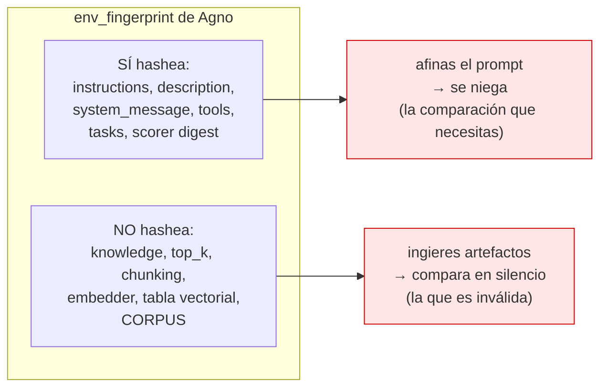
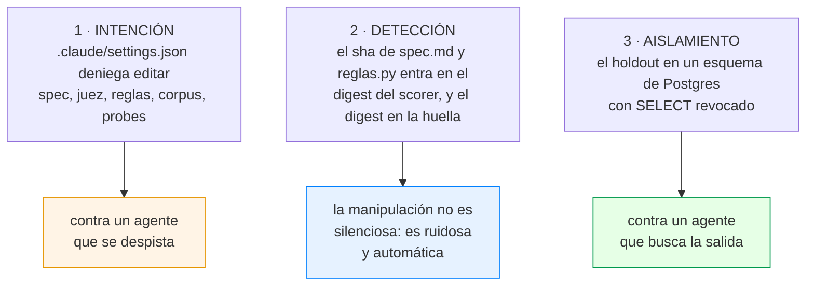
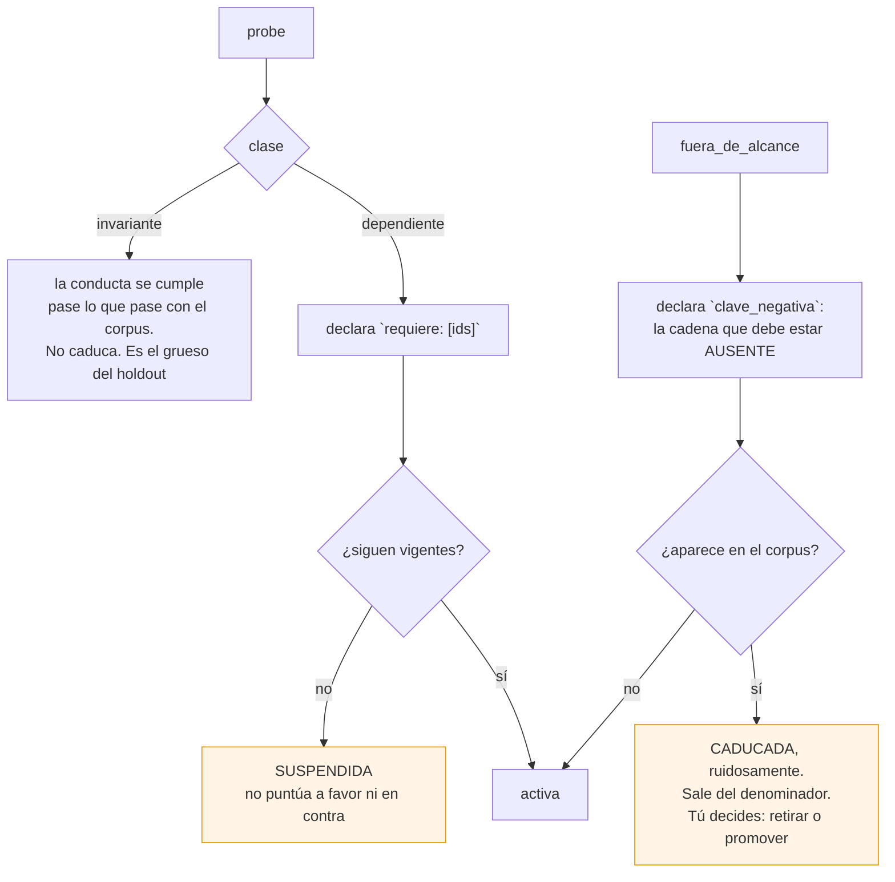

# Decisiones clave

Cada una en el mismo formato: **contexto**, **decisión**, **alternativas
descartadas** y **consecuencias**. Sin alternativas descartadas no es una
decisión, es un hecho.

---

## D1 · Congelar la vista, no el corpus

### Contexto

Un golden set mide una configuración *contra un corpus*. En una memoria de I+D
el corpus crece por definición: es el producto. El delta entre dos mediciones
mezcla dos causas y no son separables después.

La disciplina estándar —hashear el corpus y rechazar la comparación si cambia—
aplicada aquí bloquea el sistema entero: el hash cambia con cada artefacto y
ninguna comparación es legal jamás.

### Decisión

Una **época** es un corte del corpus. Cada fragmento lleva `epoca` en sus
metadatos, estampada en la ingesta.

- **Servir no filtra.** El cerebro ve todo el corpus siempre.
- **Medir filtra** a la última época cerrada.
- **Avanzar la época** es un acto humano, fechado, y está en la lista de
  nunca-automatizado.

### Alternativas descartadas

| Alternativa | Por qué no |
|---|---|
| Un índice por época | Correcto y caro: multiplica el almacenamiento y el tiempo de indexado por el número de épocas. El filtro cuesta un `WHERE` |
| Relajar el detector y comparar igual | Es la opción que todo el mundo toma sin darse cuenta. Produce números que mezclan causas |
| Golden set enteramente invariante | Elimina el problema eliminando la mitad del valor: las probes que atan una respuesta a un artefacto concreto son las que miden recuperación |

### Consecuencias

- Coste operativo: una corrida extra al mes, al avanzar la época.
- **Introduce un sesgo no medido**: filtrar un índice HNSW por metadatos es
  post-filtrado, y el grafo visita nodos que el filtro descarta. Está acotado
  por diseño —se re-mide la época ancla en cada avance— y **no medido**. Si
  resulta grande, hay que volver a la alternativa del índice por época.
- Las probes necesitan un ciclo de vida (D4).

---

## D2 · Identidad de corrida propia, no la de Agno

### Contexto

`agno.environments` calcula un `env_fingerprint` y `EnvironmentRunResult.diff()`
se niega a comparar si difiere. El payload hashea tareas, digest del scorer,
esquemas de tools y los campos que moldean el prompt.

Para un RAG eso se equivoca **en las dos direcciones**:

### Decisión

Usar `run_rollouts` como **motor de repeticiones** y no su `diff()`. La
identidad de registro son tres huellas propias:

| Huella | Cubre |
|---|---|
| `huella_config` | Troceado, tamaño, solape, contextualización, embedder, dimensión, distancia y **proveedor de embeddings** |
| `epoca` | El corte del corpus |
| `huella_juez` | Modelo del juez, sus instrucciones, y el sha de `spec.md` y `reglas.py` |

`eval --diff` se niega si difiere cualquiera, con el motivo escrito.

### Alternativas descartadas

| Alternativa | Por qué no |
|---|---|
| Parchear el fingerprint de Agno | Depender de un detalle interno de una librería que va a cambiar. `_ENV_FINGERPRINT_VERSION` ya vale `envfp2`: el payload cambió una vez y volverá a cambiar |
| Solo el hash de configuración | Deja fuera el corpus, que es exactamente el problema de este proyecto |
| Confiar en la disciplina | Es lo que falló en el proyecto anterior |

### Consecuencias

- El nombre de la tabla de fragmentos **deriva** de `huella_config`. Tocar una
  palanca de grada 3 apunta a una tabla que aún no existe: servir contra un
  índice desalineado es imposible por construcción. Y la tabla anterior sigue
  viva — eso es el rollback, sin escribir una línea de rollback.
- El `proveedor_embeddings` entra en la huella: un índice construido en modo
  mock nunca puede confundirse con uno real.

---

## D3 · El escalón 6, impedido por el tipo de dato

### Contexto

De los seis escalones de mejora —prompts, contexto estructurado, mecanismo de
contexto, grafo del workflow, código del arnés, código del optimizador—, el
sexto es el único donde el sistema puede subir su nota **sin tocar la calidad**:
le basta con relajar al juez.

Y la defensa habitual no aguanta. Una lista de permisos que deniega editar el
juez la derrota cualquier `uv run python -c`, que ejecuta Python arbitrario.

### Decisión

Tres capas, y solo la tercera aísla:

La capa 2 es la clave conceptual: **el agente puede escribir lo que quiera; lo
que no puede es hacer que su escritura cuente.** Editar el juez cambia el
digest, el digest cambia la huella, y toda comparación con lo medido antes queda
marcada como ilegal.

El patrón está tomado de `agno/scorer/judge.py:146`, cuyo propio docstring dice
que cambiar el juez «*by id, provider, base_url, sampling params, or a
model-level prompt — is an environment change*». Aquí se le añade el texto de la
spec.

### Alternativas descartadas

| Alternativa | Por qué no |
|---|---|
| Solo la lista de permisos | El propio marco de referencia admite que no aísla |
| Sandbox del proceso | Desproporcionado para un usuario en su portátil, y estorba en el día a día. Una barrera que estorba se acaba desactivando |
| Firmar criptográficamente la spec | Más ceremonia por la misma propiedad: el hash en la huella ya la da |

### Consecuencias

- Cambiar la spec **legítimamente** también invalida el histórico. Es correcto:
  cambiar la spec es cambiar el objetivo, y las mediciones anteriores medían
  otra cosa.
- El rol de la aplicación **es dueño** del esquema de trabajo: ingiere, indexa y
  migra sin pedir permiso. La frontera está solo en el holdout, y por eso no
  estorba.

---

## D4 · El ciclo de vida de las probes

### Contexto

Si el corpus se mueve, las probes envejecen. Y una categoría envejece de forma
**activamente dañina**: `fuera_de_alcance` comprueba que el sistema se calla
cuando no sabe. Cuando la respuesta entra en el corpus, la probe marca violación
—correctamente, porque el sistema ya puede responder— y con un suelo duro sobre
la abstención, **la única corrección disponible para el bucle es hacer al agente
más evasivo**.

Eso es Goodhart provocado por el crecimiento del corpus, y se parece exactamente
a un fallo legítimo.

### Decisión

Dos clases y tres mecanismos.

Y un **suelo de estrato**: si las probes activas de `fuera_de_alcance` bajan del
20 % del conjunto (mínimo 4), el arnés **se niega a correr**. No avisa: se
niega.

### Alternativas descartadas

| Alternativa | Por qué no |
|---|---|
| Borrar las probes caducadas | Silencioso. Pierdes la señal de que el corpus creció en esa dirección, que es información de producto |
| Marcarlas como fallo | Empuja al sistema a ser evasivo. Es el fallo que se quiere evitar |
| Detectar la caducidad con el juez | Comprobar que una cadena no aparece es exactamente lo que un `ilike` hace bien y un modelo hace caro y peor |
| Suelo absoluto de 12 probes | Sobre un conjunto de 21 sería el 57 %, y empujaría a escribir probes de relleno para pasar la puerta — peor que no tenerla |

### Consecuencias

- Una probe **nunca se borra**. Se retira con motivo y fecha.
- Suspender no es aprobar: el informe lista las suspendidas aparte, y quedan
  fuera del denominador. Misma semántica que Agno aplica a los intentos sin
  puntuar — un timeout no es una respuesta incorrecta.

---

## D5 · Cinco de las ocho reglas las comprueba código, no el juez

### Contexto

La spec tiene ocho reglas. La opción por defecto es que las juzgue todas un LLM.

### Decisión

R1 (cita), R2 (abstención literal), R4 (literales exactos), R7 (estatus
epistémico) y R8 (sin relleno) las decide `cerebro/reglas.py` con expresiones
regulares y comparación de cadenas. Solo R3 (memoria paramétrica), R5 (no
fusionar artefactos) y R6 (lo superado) van al juez.

### Alternativas descartadas

| Alternativa | Por qué no |
|---|---|
| Todo al juez | Cada regla que sale del juez es una fuente de sesgo menos, una llamada menos y un trozo más de señal que corre offline. Una regla que un `re.findall` puede decidir no debería depender de un modelo |
| Todo por código | R5 —«no fundas dos artefactos en una afirmación que ninguno sostiene»— no tiene forma regular. Forzarla sería convertirla en un deseo disfrazado de regla |

### Consecuencias

- El **nivel 0** —solo recuperación y reglas deterministas— corre offline, sin
  claves, en milisegundos. Es la señal que entra en CI, y es la que casi todo el
  mundo se salta.
- El coste por ronda baja proporcionalmente.
- `passed` se deriva en código y **nunca se toma del modelo**: el esquema del
  juez podría llevar un campo «pasa», pero eso es una instrucción, no una
  garantía, y la métrica que titula el informe no puede depender de que un
  modelo la respete.

---

## D6 · Fusión RRF propia, no la búsqueda híbrida de Agno

### Contexto

`PgVector.hybrid_search` existe y hace exactamente lo que promete el nombre.
Leyendo el código: su predicado `@@` está comentado (`pgvector.py:1157`), así
que escanea la tabla entera; y fusiona con `w·vector_score + (1-w)·text_rank`,
una suma lineal de un coseno y un `ts_rank_cd` normalizado.

### Decisión

Dos consultas separadas, fusionadas con **Reciprocal Rank Fusion** k=60 en
Python, con el rango de cada carril guardado **antes** de fusionar.

### Alternativas descartadas

| Alternativa | Por qué no |
|---|---|
| `SearchType.hybrid` de Agno | Dos escalas no comparables: `peso_vectorial = 0.5` no significa «mitad y mitad» y no tiene punto medio interpretable. Y es la patología del tipo de cambio: los pesos definen una tasa de conversión que el optimizador explotará |
| Un solo carril denso | El corpus está lleno de identificadores casi idénticos —`ef_search` frente a `ef_construction`, `2.8.6` frente a `2.8.x`— donde el léxico acierta y el vectorial falla |
| Parchear Agno | Mantenimiento eterno de un fork por tres funciones |

### Consecuencias

- RRF es rank-only y lane-agnostic **a propósito**: no mira los scores, solo las
  posiciones, y por eso es inmune a escalas incomparables.
- El rango por carril es lo que permite escribir la frase que de verdad
  diagnostica: *la léxica lo tenía en el puesto 1 y la vectorial en el 12*. Sin
  eso, mover el peso, el embedder y el analizador léxico son tres movimientos
  indistinguibles.
- Hay que crear los índices HNSW y GIN a mano, porque Agno no los crea.

---

## D7 · El bucle solo mueve palancas de recuperación

### Contexto

Un golden set sintético —generado a partir del corpus— **ordena bien
configuraciones de recuperación y no ordena bien arquitecturas de generación**.
Con ~10 consultas reales a la semana, el golden set de este sistema será
mayoritariamente sintético durante meses.

### Decisión

Las palancas de **generación** —hoy solo `instrucciones`— el bucle las
**propone** y las firma una persona. Está declarado en
`FAMILIA_GENERACION` de `config.py` y en el comando `/mejorar-rag`.

Condición de salida: **≥40 probes minadas de tráfico real** con etiqueta humana.

### Alternativas descartadas

| Alternativa | Por qué no |
|---|---|
| Dejar que el bucle mueva todo | Optimizar contra una medida que no distingue. Los números suben y el sistema no mejora |
| No usar golden set sintético | Sin él no hay nada que medir el primer día, y esperar un año de tráfico antes de empezar es peor |

### Consecuencias

- `rag serve` registra cada consulta y expone una ruta de voto **desde el primer
  día**. Cada pulgar abajo es un candidato a probe.
- **No se puede añadir retroactivamente**: el techo del proyecto se fija el día
  que arranca.
- A 10 consultas/semana y un 20 % marcadas, son ~100 probes reales en un año.

---

## Lo que NO se automatiza, nunca

| | Mecanismo |
|---|---|
| Migraciones destructivas | deny-list |
| Borrado de conocimiento — solo invalidación | `escritura` no tiene `DELETE` salvo en `--recrear` |
| El modelo de embeddings | deny-list + no está en `Palancas` |
| Los suelos de la spec | deny-list + el digest |
| La época de medición | deny-list |
| El holdout | rol de Postgres |
| **El juez y el propio bucle** | el digest en la huella |
