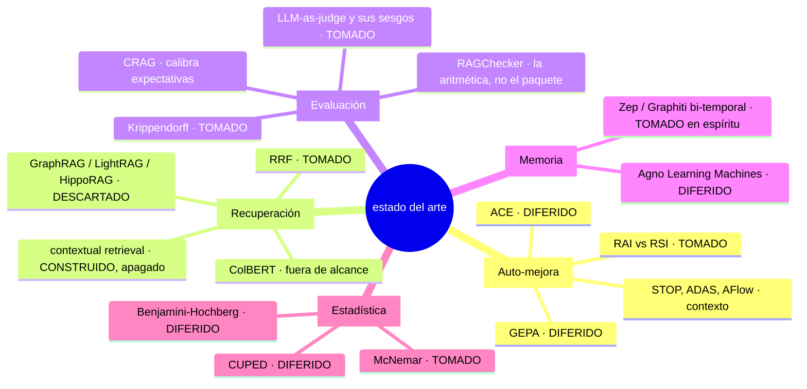
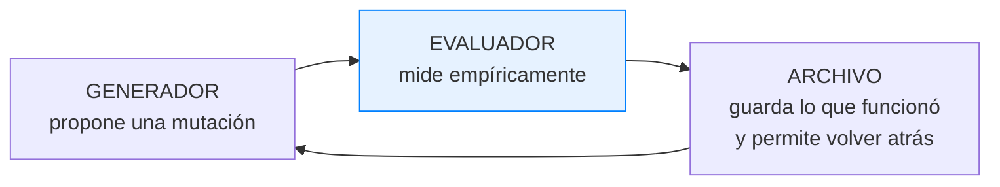

# Estado del arte

Qué existe, qué se tomó, qué se descartó y **por qué**. Cada apartado dice si lo
que se afirma está probado, reportado por sus autores o es extrapolación propia
— la misma disciplina que el corpus exige a sus artefactos.



---

## 1 · Auto-mejora de sistemas de agentes

### RAI frente a RSI — tomado, y es el eje

La distinción que ordena el proyecto: **RSI** (*recursive self-improvement*) es
divergente —el sistema se mejora a sí mismo, las mejoras apuntan a su capacidad
de mejorar, las ganancias se componen, y no hay criterio de parada—. **RAI**
(*recursive auto-improvement*, también citado como *automated*) es convergente: una IA mejora a **otra**, sin
auto-referencia, hacia un punto fijo que es la spec del artefacto.

> Para software de producción, convergente es exactamente lo que queremos.

El equivalente de la spec en un RAG es el **golden set**: dada esta pregunta, el
fragmento X debe estar entre los recuperados y la respuesta debe derivarse de
él. Una spec que no se puede comprobar no acota nada.

**Qué se toma:** la distinción entera, los cinco requisitos de infraestructura
(consultar el sistema vivo, leer la traza, cambiar el diseño y remedir, minar el
uso real, consultar el framework), la mecánica de una palanca por fallo, el tope
de cinco rondas, re-ejecutar solo lo que falló, y convertir los fallos en evals
permanentes.

**Qué NO cubre la fuente:** habla de agentes, no de RAG, y sus bancos de prueba
tienen el corpus congelado. Toda la extensión al corpus vivo es propia y **no
está validada en ningún benchmark publicado**.

### El patrón canónico: generador · evaluador · archivo



> Quítale el evaluador y tienes un LLM alucinando mejoras. Quítale el archivo y
> tienes un sistema que se olvida de lo que probó, oscila y regresiona.

Trabajos que convergen en esta forma: **STOP** (2023, un programa que se mejora
a sí mismo), **Reflexion** (reflexión textual como señal), **TextGrad**
(gradientes textuales), **ADAS** y **AFlow** (búsqueda sobre el grafo del
workflow), **Darwin Gödel Machine** (archivo de candidatos), **AlphaEvolve**
(MAP-Elites e islas), **GEPA** (optimización de prompts por reflexión), **ACE**
(contexto como playbook que evoluciona).

**Qué se toma:** el archivo (`runs/`, que no se borra nunca) y el principio de
que **la validación empírica gana al razonamiento sobre el cambio**. Cuando el
optimizador diga «esto debería mejorar el recall porque…», ignóralo y mídelo.

**Qué se difiere y por qué:**

| | Condición de entrada |
|---|---|
| **GEPA** | `max_metric_calls ≈ 150` contra un golden set de 41 probes son ~3,7 pasadas: elegiría entre candidatos con estimaciones ruidosísimas, y con un juez sin calibrar estaría optimizando el ruido del juez. **Entra con n ≥ 120 probes y α ≥ 0,70** |
| **ACE / playbook evolutivo** | Es Fase 2. Antes hay que tener el bucle barato corriendo |
| **AFlow / MAP-Elites** | Fase 4. Con ~12 palancas de grada 1-2 y un solo evaluador, el frente de Pareto y el archivo bastan |

### La escalera de escalones — tomada

```
6 · código del optimizador o del juez   ⛔ NUNCA se automatiza
5 · código del arnés
4 · grafo del workflow
3 · mecanismo de contexto — qué se recupera y cómo
2 · contexto estructurado
1 · prompts                              ← lo más barato
```

**La regla operativa:** *arregla cada fallo recurrente en el escalón más bajo
que pueda expresarlo.* Construir un carril de grafo para un fallo que arregla
`fts_modo` es subir cuatro escalones de más, y a partir de ahí todo cuesta más
para siempre.

El escalón 6 es el único donde el sistema puede subir su nota sin tocar la
calidad. Aquí no está prohibido: está **impedido** (ver
[D3](01-decisiones.md#d3--el-escalón-6-impedido-por-el-tipo-de-dato)).

---

## 2 · Recuperación

### Reciprocal Rank Fusion — tomado

Cormack, Clarke y Buettcher, SIGIR 2009. `score(d) = Σ 1/(k + rango_i(d))`, con
`k = 60` como valor canónico — el que usan Weaviate, Vespa y OpenSearch por
defecto.

**Por qué RRF y no una suma ponderada de scores:** RRF es rank-only y
lane-agnostic *a propósito*. No mira los scores, solo las posiciones, y por eso
es inmune a fusionar escalas que no son comparables. Una suma ponderada de un
coseno y un `ts_rank_cd` define un tipo de cambio entre métricas, y un
optimizador lo explotará.

> **Aviso que cuesta caro:** Qdrant usa `k=2` por defecto y con otra fórmula.
> Cualquier umbral copiado de un ejemplo está sesgado si no se fija `k`
> explícitamente. Aquí es una palanca con valor declarado.

### Contextual retrieval — construido, apagado por defecto

Anthropic, septiembre 2024. Antepone a cada fragmento una o dos frases generadas
por un LLM que lo sitúan en su documento, **antes** de embeber. Reportan ~35 %
menos fallos de recuperación, y 49 % combinado con BM25 y reordenación.

**Estatus de esa cifra:** `reportado`. Auto-reportada por sus autores, sin
réplica independiente, y sobre otro corpus.

**Qué se hace aquí:** está implementado como una `ChunkingStrategy` propia, es
palanca de **grada 3** (entra en la huella del índice: cambiar la plantilla
cambia cada vector del corpus) y viene **apagada**. Existe para que el bucle
tenga una palanca de grada 3 real que ganarse, no para encenderla el primer día.

Y una versión barata sí está encendida siempre: `ConMetadatos` antepone a cada
fragmento su título, tipo y temas. Cuesta cero llamadas y resuelve el caso más
común —el fragmento 7 llega al índice sin decir de qué artefacto es—.

### GraphRAG, LightRAG, HippoRAG — descartados, con trigger

| Enfoque | Qué aporta | Por qué no, aquí |
|---|---|---|
| **GraphRAG** (Microsoft) | Resúmenes de comunidad para agregación cross-documento | Coste de construcción alto en llamadas de LLM. Y el caso que resuelve —«¿cuáles son los temas de todo el corpus?»— aquí cabe en un prompt: 450 artefactos con título y resumen son ~11k tokens |
| **LightRAG** | Actualización incremental del grafo | Interesante si hubiera grafo. No lo hay |
| **HippoRAG** | PageRank personalizado con semillas del query, ponderación por grado inverso | Exige un snapshot del grafo en memoria, invalidación y caché. En el proyecto anterior eso trajo una caché entre procesos con incoherencia documentada |
| **LazyGraphRAG** | Difiere la sumarización al momento de la consulta | Es la arquitectura correcta **si** llega el grafo. Está anotada como la opción por defecto para ese día |

**El trigger, escrito y no negociable:** el carril de grafo se construye si la
categoría `multi_hop` cae por debajo de 0,60 **tras agotar las palancas de grada
1-2**. Las comunidades, si `aggregation` cae y el corpus supera los 5M tokens.
El trigger es una categoría del golden set cayendo, no una corazonada.

### Lo que no está y no se contempla

**ColBERT / multi-vector late interaction**, **re-ranking neuronal como
defecto**, **routing aprendido entre subsistemas** (Adaptive-RAG, MoR,
MBA-RAG). El routing existe para elegir entre subsistemas heterogéneos y aquí
hay uno solo. Y aunque hubiera varios: con del orden de 10 consultas a la SEMANA —el volumen real de un usuario, no las 20 diarias de un equipo— un clasificador o un bandit tardarían meses
en converger; una regla escrita a mano da probablemente el 80 % del beneficio.

---

## 3 · Evaluación

### RAGChecker — la aritmética, no el paquete

Amazon, NeurIPS 2024. La mejor descomposición formal por componente que existe:
parte respuesta y referencia en **afirmaciones atómicas** y usa *entailment*
para atribuir el fallo al retriever o al generador.

```
claim_recall bajo                            -> RETRIEVER
claim_recall alto + context_utilization bajo -> GENERADOR (lo tenía y no lo usó)
hallucination alto                           -> GENERADOR (inventa)
noise_sensitivity alto                       -> GENERADOR (traga ruido)
self_knowledge alto                          -> RETRIEVER ROTO ENMASCARADO
```

> **La cifra que casi nunca se cita:** en su meta-evaluación, el acuerdo entre
> anotadores **humanos** sobre los mismos casos fue **70,09**. Ese es el techo,
> no 100.

**Decisión:** se copia la aritmética y **no la dependencia**. Última versión
publicada 0.1.9, septiembre de 2024; repositorio sin commits desde diciembre de
ese año. Sus fórmulas siguen siendo la mejor atribución por componente que
conozco; el paquete no debería entrar en un proyecto nuevo.

### CRAG — calibra las expectativas

Meta, NeurIPS 2024. Sobre su benchmark: GPT-4 Turbo sin recuperación acierta el
34 %; un RAG naíf, el 44 %; el mejor sistema del KDD Cup, el 51 %. Y las
soluciones industriales del estado del arte **responden solo el 63 % de las
preguntas sin alucinar**.

No se usa como banco de pruebas —este corpus es privado y no hay «el mundo» con
el que compararlo—, pero fija el orden de magnitud de lo que es razonable
esperar.

### LLM como juez, y sus cuatro sesgos

| Sesgo | Mitigación aquí |
|---|---|
| **Posición** | El juez es puntual, no pareado. Y **no se baraja el orden de los fragmentos**: el orden *es* la señal de diagnóstico |
| **Verbosidad** | Se elimina del prompt la instrucción «no premies las respuestas largas». La longitud la comprueba R8 por código; añadirla al juez sería una restricción que arbitra contra las que sí importan |
| **Self-preference** | **Tres familias de modelo disjuntas** —generador de probes, sistema, juez— con un `assert` que revienta el import si dos coinciden. El auto-reconocimiento *causa* la auto-preferencia (Panickssery et al., NeurIPS 2024) |
| **Sycophancy** | Rúbrica cerrada. `espera` describe comportamiento, nunca el texto de la respuesta, así que el juez no puede casar patrones. Y no ve el diagnóstico previo ni la palanca que se está probando |

**Y una reducción estructural:** cinco de las ocho reglas las comprueba código.
Cada regla que sale del juez es una fuente de sesgo menos
([D5](01-decisiones.md#d5--cinco-de-las-ocho-reglas-las-comprueba-código-no-el-juez)).

### Krippendorff α — la puerta

α ≥ 0,60 sobre el acuerdo juez-humano, o el bucle no arranca. Implementado sin
dependencias (~30 líneas) porque es el estadístico que fija la puerta y no
conviene que dependa de una librería.

Con **un solo anotador** no hay acuerdo inter-anotador. El sustituto honesto es
el **techo intra**: re-etiquetar 20 casos a ciegas siete días después. Y la
lectura importa: si α_intra < 0,70, **lo roto es la rúbrica, no el juez** — es
un diagnóstico distinto y lleva a una acción distinta, así que confundirlos
cuesta semanas.

### El sesgo del golden set sintético

Chroma Research midió que generar preguntas desde el propio fragmento infla
`recall@10` entre 5 y 9 puntos artificialmente. Y la puerta de admisibilidad que
gobierna este proyecto: un golden set sintético **ordena bien configuraciones de
recuperación y no ordena bien arquitecturas de generación**
([D7](01-decisiones.md#d7--el-bucle-solo-mueve-palancas-de-recuperación)).

**Prohibido aquí:** filtrar las preguntas generadas por «que el retriever
recupere el fragmento original». Garantiza recall@1 por construcción y convierte
la métrica en una tautología.

---

## 4 · Memoria y modelos temporales

### Zep / Graphiti — tomado en espíritu, no en implementación

Grafo de conocimiento **bi-temporal**: cada arista lleva cuándo el hecho fue
cierto (`t_valid` / `t_invalid`) y cuándo el sistema se enteró (`t_created` /
`t_expired`). Cuando llega información que contradice un hecho, el sistema
**cierra la ventana de validez del hecho antiguo en lugar de borrarlo**.

**Qué se toma:** el principio entero, con nombre propio — *no reviertas:
invalida*. Aquí son dos columnas (`valido_desde`, `valido_hasta`) y un filtro de
metadatos, no un motor de grafos.

**Qué NO se toma:** el grafo. Bi-temporalidad son dos columnas; no hace falta
Neo4j ni Apache AGE para tenerla. Y hay una lección directa del proyecto
anterior: con Apache AGE 1.5, un `SET` que sigue a un `MERGE` que crea una
relación **se descarta en silencio**, así que toda arista nació con
`properties: {}` y el modelo bi-temporal quedó decorativo.

### Agno Learning Machines — diferido

`agno.learn` trae seis stores —UserProfile, UserMemory, SessionContext,
EntityMemory, **LearnedKnowledge**, **DecisionLog**— con tres modos de
extracción.

**Por qué no todavía:** `LearnedKnowledge` es lo más interesante —insights
transferibles entre sesiones— pero su tabla no tiene columna de embedding y se
busca con `ILIKE` sobre el contenido casteado a texto. Para «relacionar
contextos dispares» eso no vale; un fichero markdown en pgvector es
estrictamente mejor.

Y el modo `PROPOSE` **no es una puerta de aprobación real**: la propia
documentación de Agno advierte que depende de que el modelo respete una
instrucción del prompt.

**Condición de entrada:** cuando el corpus esté vivo y haya tráfico real que
genere insights que no estén ya en los artefactos.

---

## 5 · Estadística

### McNemar exacto — tomado, en lugar de Benjamini-Hochberg

El protocolo es **una palanca por ronda, cinco rondas**. No hay multiplicidad
que corregir, así que BH —que controla la tasa de falsos descubrimientos entre
muchas comparaciones— resuelve un problema que aquí no existe.

Lo correcto para resultados binarios pareados es McNemar sobre los
**discordantes**: las probes que las dos configuraciones aciertan y las que las
dos fallan no dicen nada sobre cuál es mejor. Y binomial exacto, no
chi-cuadrado: con ~30 probes los discordantes suelen ser menos de ocho y ahí la
aproximación miente.

> **El suelo honesto:** hacen falta **6 vuelcos netos** para detectar algo a
> α=0,05. Por debajo, ninguna corrección estadística lo cambia — es el suelo del
> instrumento, no del método. El informe lo imprime en vez de dejar que un
> p-valor bonito lo disimule.

### La maldición del ganador

Tsamardinos et al. documentan hasta **20 puntos de AUC de optimismo** por
seleccionar la mejor de muchas configuraciones. Y lo contraintuitivo: **la
validación cruzada no lo arregla**.

Defensas implementadas: un holdout que se mira una vez, la negativa a comparar
corridas no comparables, y el umbral de aceptación `max(2σ, 1/n)`.

### CUPED y multi-fidelidad — diferidos, con motivo escrito

| | Por qué no todavía |
|---|---|
| **CUPED** | Reduce varianza con una covariable (~50 % en los A/B de Bing). Con n≈30 y resultados binarios, la covarianza produce un θ **confiadamente equivocado**, que es peor que no ajustar. Y la evaluación pareada ya captura casi toda la reducción. **Entra a partir de ~150 probes y con una métrica continua** |
| **Successive Halving / Hyperband / ASHA** | Asignan presupuesto entre **muchos** candidatos. Con uno por ronda no hay problema de asignación que resolver |

El módulo de estadística lleva escrito **por qué no están**. Una caja de
herramientas que no dice cuándo NO usarse invita a aplicarla donde no toca.

---

## 6 · Suelos duros frente a suma ponderada

Si la función objetivo es `0,4·recall + 0,3·faithfulness + 0,3·relevancy`, los
pesos definen un **tipo de cambio** entre métricas, y el optimizador lo usará
para maximizar el número sacrificando justo lo que querías proteger.

**La alternativa es ε-constraint:** una métrica primaria y el resto como
restricciones duras. Sin suma no hay tipo de cambio, y `faithfulness` deja de
poder venderse a cambio de `recall`.

Y aquí, dos refinamientos propios:

1. **Los suelos que importan van en recuento, no en tasa.** Con las 41 probes
   actuales el semiancho del intervalo de confianza al 95 % ronda ±11 puntos:
   un suelo de «0,85» no es exigible porque el instrumento no lo distingue de
   0,75. Cero violaciones sí es exigible a cualquier n.
2. **Una violación tiene que reproducirse.** R4 a cero, con un juez al ~95 % de
   auto-consistencia —supuesto ilustrativo, no una medición de este sistema—
   sobre 41 probes, da `1 − 0,95⁴¹ ≈ 88 %` de probabilidad de al menos una
   violación espuria por corrida. El suelo más importante bloquearía la
   promoción a cara o cruz. Se re-corren solo las sospechosas a k=3 y se exige
   mayoría.

---

## Resumen: qué es propio y qué no

**De la literatura, tomado tal cual:** RAI/RSI, los cinco requisitos, una
palanca por fallo, el tope de cinco rondas, la escalera de escalones, el juez
que devuelve diagnóstico, RRF k=60, la aritmética de RAGChecker, los cuatro
sesgos del juez y sus mitigaciones, α de Krippendorff como puerta, ε-constraint,
bi-temporalidad en espíritu, McNemar.

**Extrapolación propia, no validada en ningún benchmark publicado:**

- Las **épocas** como mecanismo para medir un corpus que crece.
- La **tercera huella** y la negativa a comparar como tipo de dato.
- El **digest del juez que sella la spec** como impedimento del escalón 6.
- El **ciclo de vida de las probes**: suspensión frente a fallo, clave negativa,
  caducidad ruidosa, suelo de estrato proporcional.
- Los suelos **en recuento** y la reproducción a k=3.
- La separación **recuperación / generación** en lo que el bucle puede tocar
  solo.

Nada de eso está medido contra una alternativa. Están construidos, verificados
como mecanismo, y pendientes de la primera corrida con un modelo real.


---

## Referencias

Ordenadas por la sección donde aparecen. Los identificadores están transcritos a
mano: si alguno no resuelve, el título y el año bastan para encontrarlo.

### Recuperación y fusión

- Cormack, G. V., Clarke, C. L. A. & Buettcher, S. (2009). *Reciprocal Rank
  Fusion Outperforms Condorcet and Individual Rank Learning Methods.* SIGIR '09,
  758–759. [doi:10.1145/1571941.1572114](https://doi.org/10.1145/1571941.1572114)
  — de aquí sale `k = 60`.
- Khattab, O. & Zaharia, M. (2020). *ColBERT: Efficient and Effective Passage
  Search via Contextualized Late Interaction over BERT.* SIGIR '20.
  [arXiv:2004.12832](https://arxiv.org/abs/2004.12832) — fuera de alcance aquí,
  anotado por si el corpus crece un orden de magnitud.
- Gao, L., Ma, X., Lin, J. & Callan, J. (2022). *Precise Zero-Shot Dense
  Retrieval without Relevance Labels* (HyDE).
  [arXiv:2212.10496](https://arxiv.org/abs/2212.10496) — costura, no construida.
- Anthropic (2024). *Introducing Contextual Retrieval.*
  <https://www.anthropic.com/news/contextual-retrieval> — construido y apagado
  por defecto. La cifra de mejora que reporta es **auto-reportada y sobre otro
  corpus**; en este no está medida.

### Grafos de conocimiento

- Edge, D. et al. (2024). *From Local to Global: A Graph RAG Approach to
  Query-Focused Summarization.*
  [arXiv:2404.16130](https://arxiv.org/abs/2404.16130) — descartado, con
  disparador escrito.
- Guo, Z. et al. (2024). *LightRAG: Simple and Fast Retrieval-Augmented
  Generation.* [arXiv:2410.05779](https://arxiv.org/abs/2410.05779) —
  actualización incremental del grafo; interesante si hubiera grafo.
- Gutiérrez, B. J. et al. (2024). *HippoRAG: Neurobiologically Inspired
  Long-Term Memory for Large Language Models.*
  [arXiv:2405.14831](https://arxiv.org/abs/2405.14831)
- Traag, V. A., Waltman, L. & van Eck, N. J. (2019). *From Louvain to Leiden:
  guaranteeing well-connected communities.* Scientific Reports 9, 5233.
  [doi:10.1038/s41598-019-41695-z](https://doi.org/10.1038/s41598-019-41695-z)
- Rasmussen, P. et al. (2025). *Zep: A Temporal Knowledge Graph Architecture for
  Agent Memory.* [arXiv:2501.13956](https://arxiv.org/abs/2501.13956) — tomado
  en espíritu (bi-temporalidad), no en implementación.

### Evaluación

- Ru, D. et al. (2024). *RAGChecker: A Fine-grained Framework for Diagnosing
  Retrieval-Augmented Generation.*
  [arXiv:2408.08067](https://arxiv.org/abs/2408.08067) — se copia la aritmética,
  no la dependencia. De aquí sale el techo de **70,09** de acuerdo entre
  anotadores humanos.
- Yang, X. et al. (2024). *CRAG — Comprehensive RAG Benchmark.*
  [arXiv:2406.04744](https://arxiv.org/abs/2406.04744) — calibra expectativas
  sobre cuánto se puede esperar de un RAG bien hecho.
- Zheng, L. et al. (2023). *Judging LLM-as-a-Judge with MT-Bench and Chatbot
  Arena.* [arXiv:2306.05685](https://arxiv.org/abs/2306.05685) — sesgos de
  posición y verbosidad.
- Wang, P. et al. (2023). *Large Language Models are not Fair Evaluators.*
  [arXiv:2305.17926](https://arxiv.org/abs/2305.17926)
- Panickssery, A., Bowman, S. R. & Feng, S. (2024). *LLM Evaluators Recognize
  and Favor Their Own Generations.* NeurIPS 2024.
  [arXiv:2404.13076](https://arxiv.org/abs/2404.13076) — el
  auto-reconocimiento **causa** la auto-preferencia. Es el motivo del `assert`
  de tres familias disjuntas.

### Acuerdo entre anotadores y estadística

- Hayes, A. F. & Krippendorff, K. (2007). *Answering the Call for a Standard
  Reliability Measure for Coding Data.* Communication Methods and Measures 1(1),
  77–89. [doi:10.1080/19312450709336664](https://doi.org/10.1080/19312450709336664)
  — la α y sus umbrales de referencia (0,667 tentativo, 0,80 firme). Por qué
  aquí la puerta está en 0,60 se explica en el
  [glosario](99-glosario.md#de-la-medición).
- McNemar, Q. (1947). *Note on the sampling error of the difference between
  correlated proportions or percentages.* Psychometrika 12(2), 153–157.
  [doi:10.1007/BF02295996](https://doi.org/10.1007/BF02295996) — el test
  correcto para dos configuraciones sobre las mismas preguntas.
- Benjamini, Y. & Hochberg, Y. (1995). *Controlling the False Discovery Rate.*
  JRSS B 57(1), 289–300.
  [doi:10.1111/j.2517-6161.1995.tb02031.x](https://doi.org/10.1111/j.2517-6161.1995.tb02031.x)
  — **no** se usa: controla FDR entre muchas comparaciones, y aquí se prueba una
  palanca por ronda.
- Deng, A., Xu, Y., Kohavi, R. & Walker, T. (2013). *Improving the Sensitivity
  of Online Controlled Experiments by Utilizing Pre-Experiment Data* (CUPED).
  WSDM '13. [doi:10.1145/2433396.2433413](https://doi.org/10.1145/2433396.2433413)
  — diferido: con n pequeño y resultados binarios, θ sale confiadamente
  equivocado.
- Tsamardinos, I., Greasidou, E. & Borboudakis, G. (2018). *Bootstrapping the
  out-of-sample predictions for efficient and accurate cross-validation.*
  Machine Learning 107, 1895–1922.
  [doi:10.1007/s10994-018-5714-4](https://doi.org/10.1007/s10994-018-5714-4) —
  la maldición del ganador, y por qué existe el holdout.

### Optimización de prompts y auto-mejora

- Khattab, O. et al. (2023). *DSPy: Compiling Declarative Language Model Calls
  into Self-Improving Pipelines.*
  [arXiv:2310.03714](https://arxiv.org/abs/2310.03714)
- Agrawal, L. A. et al. (2025). *GEPA: Reflective Prompt Evolution Can Outperform
  Reinforcement Learning.*
  [arXiv:2507.19457](https://arxiv.org/abs/2507.19457) — diferido hasta
  n ≥ 120 probes y α ≥ 0,70.

### El marco propio y su origen

Conviene separar tres capas, porque una versión anterior de este párrafo las
mezclaba y contradecía al README:

- **RAI frente a RSI** y los cinco requisitos de un sistema auto-mejorante son de
  [Ashpreet Bedi](https://www.ashpreetbedi.com/recursive-auto-improvement).
- **El vocabulario operativo** —gradas, fases con puertas, escalera de escalones,
  juez con diagnóstico, suelos duros / ε-constraint, «una palanca por ronda»— es
  de la serie de entradas del autor de este proyecto, escrita sobre lo anterior.
  Está resumido en el [glosario](99-glosario.md#de-la-doctrina-de-auto-mejora).
- **«No reviertas: invalida»** como principio bi-temporal aparece con nombre
  propio en Zep/Graphiti (§4) y es también una regla de la doctrina del autor. Se
  toma de los dos sitios, y no es original de este repositorio.

Este repositorio es la implementación de todo lo anterior y, en varios puntos,
su corrección.
