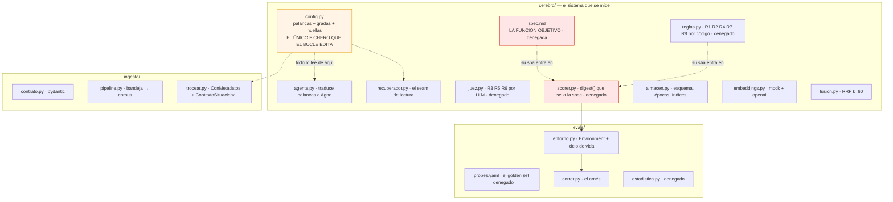
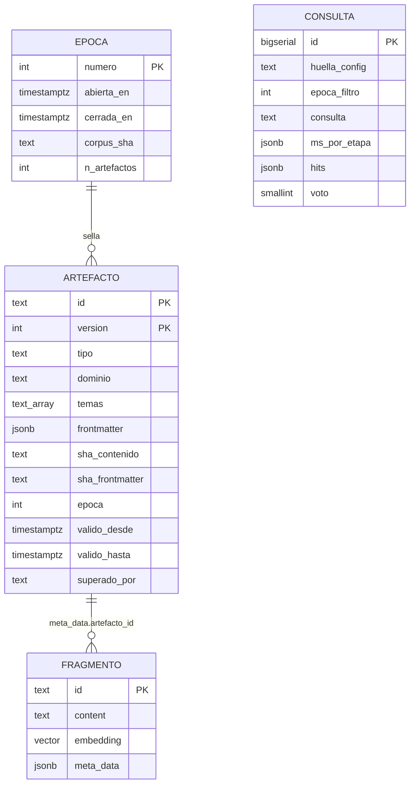
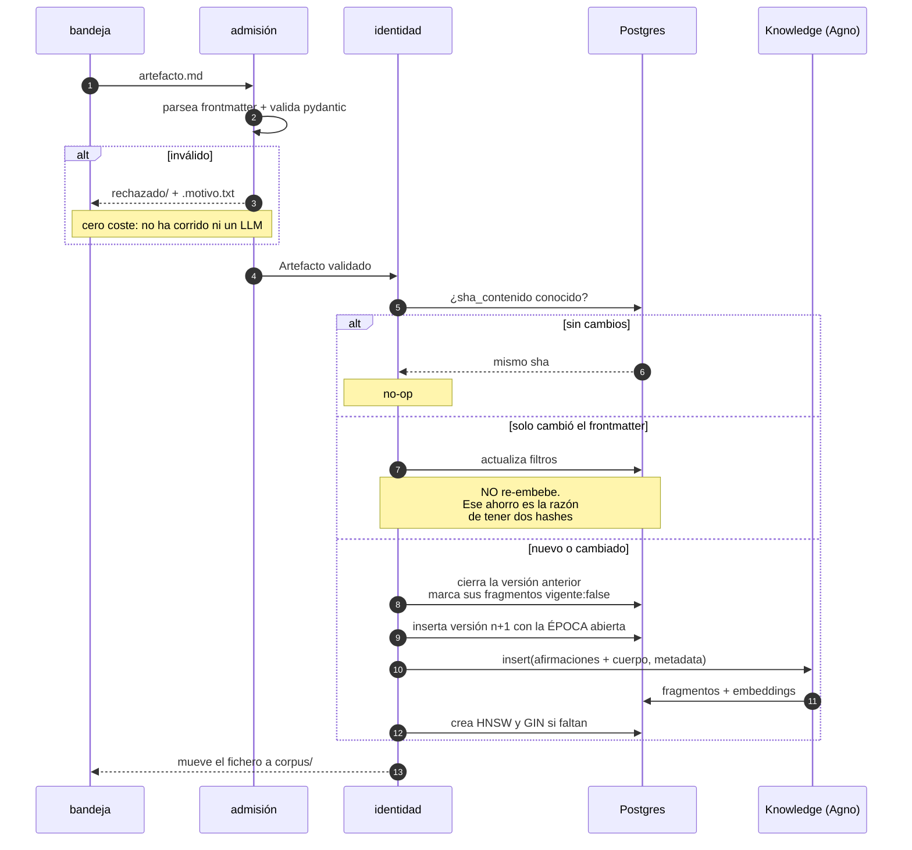
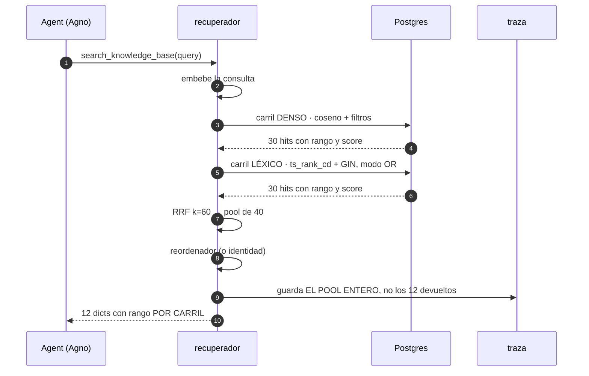
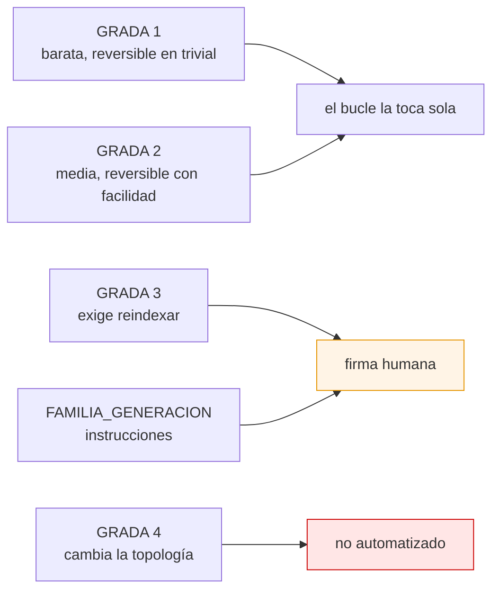
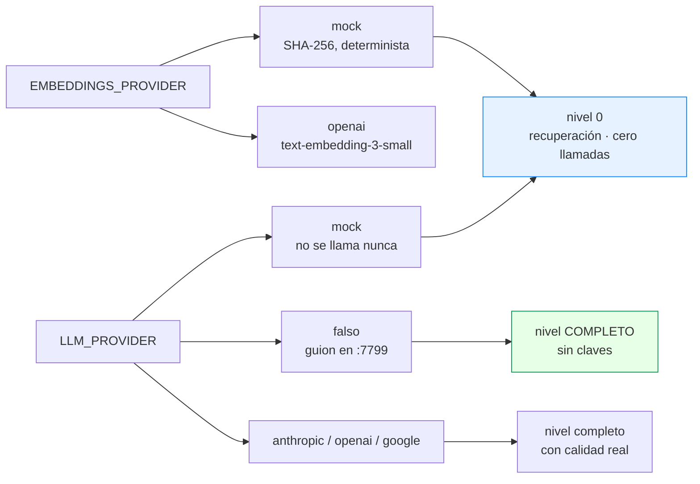

# Arquitectura

Componente a componente, con el porqué al lado. Para las decisiones de fondo,
ver [01-decisiones](01-decisiones.md).

---

## Mapa



Lo marcado en rojo está **denegado a la edición** por `.claude/settings.json`.
Lo naranja es lo único que el bucle puede tocar.

---

## El sustrato

**Postgres 17 con pgvector, y nada más.** Sin Apache AGE, sin Redis, sin worker
separado.



`FRAGMENTO` es la tabla de Agno: **la posee `PgVector`**, no nosotros. Forkearla
para añadir tres columnas sería pagar mantenimiento eterno; lo nuestro va en
`meta_data`, que es lo que PgVector filtra.

**Su nombre deriva del hash de la configuración** (`fragmento_5645f428a2b1`).
Tocar una palanca de grada 3 apunta a una tabla que aún no existe: servir contra
un índice construido con otra configuración es imposible por construcción. Y la
tabla anterior sigue viva — eso es el rollback.

### Los índices se crean a mano

```sql
create index "fragmento_<hash>_hnsw" on investigacion."fragmento_<hash>"
  using hnsw (embedding vector_cosine_ops) with (m = 16, ef_construction = 200);

create index "fragmento_<hash>_gin" on investigacion."fragmento_<hash>"
  using gin (to_tsvector('spanish', content));
```

No es preferencia. `PgVector.create()` crea la tabla con cuatro índices btree y
nada más; `_create_vector_index` y `_create_gin_index` solo se llaman desde
`optimize()`, **al que nadie llama**. Y su versión del GIN interpola el idioma
sin comillas, así que falla con `spanish`.

---

## Ingesta



**Orden de operaciones, y por qué es idempotente en los dos modos de fallo:**
primero el COMMIT, después mover el fichero. Si mover falla, la reingesta
encuentra el mismo sha y no hace nada. Si el COMMIT falla, el fichero sigue en
la bandeja.

**La carpeta ES la dead-letter queue** y se ve con `ls` sin abrir psql. Es la
respuesta directa a un pipeline anterior que descartaba eventos de tres formas
en silencio y no tenía DLQ.

**Puerta de lote:** si más del 50 % de un lote se rechaza, el lote entero se
para y no se mueve nada. No es que un fichero esté mal — es que cambiaste la
plantilla y estás a punto de ingerir lo que no es.

### El contrato de artefacto

Cinco campos obligatorios, y ese número es una decisión: cada campo obligatorio
de más es fricción en cada artefacto, y la fricción en la ingesta no se paga una
vez, se paga siempre.

```yaml
---
tipo: teardown-repo          # uno de siete
titulo: >-                   # la TESIS, no una etiqueta
  En Agno 2.8.6, PgVector nunca crea sus índices
fecha: 2026-08-12
temas: [agno, pgvector, indices]     # libres, minúsculas, deduplicados
dominio: recuperacion                # vocabulario CERRADO de 8 valores
---
```

`temas` es libre y `dominio` es cerrado, y no es redundancia: **es el único eje
sobre el que «relacionar contextos dispares» es computable** en vez de una
intuición. La minería de analogías necesita poder decir `a.dominio != b.dominio`.
Se captura desde el primer artefacto aunque esa minería sea una costura no
construida, porque un metadato que no capturas al ingerir no se rellena después
sin releerlo todo.

**Las afirmaciones se indexan por delante del cuerpo.** Descubierto midiendo:
con solo el cuerpo, buscar «MismatchError» no devolvía nada aunque el artefacto
tratara exactamente de eso, porque el término solo vivía en el frontmatter. Un
corpus que descarta las afirmaciones indexa la prosa y tira el resumen.

---

## Recuperación



Los carriles corren **en secuencia**. A ~10³ fragmentos son milisegundos y el
paralelismo sería complejidad sin premio; deja de ser cierto alrededor de los
10⁴-10⁵, y `ms_por_etapa` en la traza es donde se ve venir.

### Por qué el recuperador es propio

Tres motivos, todos verificados contra 2.8.6:

1. **Por el camino por defecto el score se pierde.** `Document.to_dict()`
   devuelve solo `{name, meta_data, content}`: descarta `id` y
   `reranking_score`. Sin score no hay forma de distinguir «el fragmento no
   llegó» de «llegó enterrado» — los dos diagnósticos que abren juegos de
   palancas distintos.
2. **`hybrid_search` no sirve** (predicado `@@` comentado, fusión por suma
   lineal de escalas incomparables).
3. **Hace falta el rango POR CARRIL, antes de fusionar.** Sin él, mover el peso
   de fusión, el embedder y el analizador léxico son tres movimientos
   indistinguibles.

### Un bug que solo aparece midiendo

`plainto_tsquery` une los términos con **AND**:

```
"por qué el índice HNSW no existe"  ->  'indic' & 'hnsw' & 'exist'  ->  0 hits
                                    ->  'indic' | 'hnsw' | 'exist'  ->  el ranking
```

Con AND, cuanto más informativa es la pregunta, menos recupera. El carril léxico
devolvía cero en todas las consultas y **no lanzaba ningún error**. Ahora es la
palanca `fts_modo`, porque AND frente a OR es un compromiso real entre precisión
y cobertura.

---

## Palancas y gradas



La **clase de reindexado** es una propiedad distinta de la grada y se declara
aparte: hay palancas de grada 3 que solo reconstruyen el grafo ANN (CPU, sin
llamadas de embedding) y otras que obligan a re-embeber el corpus entero
(dinero). Confundirlas cuesta dinero en una dirección y corrección en la otra.

### Los cinco asserts

`config.py` no arranca si alguno falla. Cada uno convierte un fallo silencioso
en un error de import:

| assert | El fallo que impide |
|---|---|
| Toda palanca tiene grada | Sin él, `grada_de()` devuelve 4 por defecto y la palanca queda fuera del alcance del bucle **en silencio** |
| Toda palanca tiene clase de reindexado | El defecto sería «todo», y una palanca barata marcada como cara nunca se prueba |
| `INDEX_BOUND` no nombra palancas inexistentes | Un nombre mal escrito dejaría el hash intacto mientras la configuración cambia |
| **Tres familias de modelo disjuntas** | El auto-reconocimiento *causa* la auto-preferencia. `atlas-rai` tiene este defecto por defecto (`modelo == modelo_juez`); aquí no arranca |
| **Censura doble** | Un diagnóstico sin ninguna palanca barata se mediría ronda tras ronda sin poder corregirse, agotaría las cinco y concluiría «problema estructural» |

---

## Modos de arranque



**El mock no es un juguete.** Produce pseudo-embeddings derivados de SHA-256,
deterministas y L2-normalizados. No tienen significado semántico —dos textos
parecidos no dan vectores parecidos— pero hacen que el pipeline entero funcione:
ingesta, indexado, recuperación, fusión y evaluación de nivel 0.

Y una diferencia deliberada con el proyecto anterior: allí, pedir OpenAI sin
clave **degradaba a determinista con un warning que nadie leía**. Aquí revienta.
Un índice mock y uno real no son el mismo índice, y el proveedor entra en la
huella justamente para que las dos tablas ni se llamen igual.

### El modo `falso`

`scripts/modelo_falso.py` habla el protocolo de OpenAI, **incluido SSE**. Con
él, «arranca sin claves» pasa de significar *solo el nivel 0* a significar el
nivel completo: dos vueltas de tool call, `output_schema` del juez, extracción
de `references`, scorer y rollouts.

> **Por qué SSE no es opcional.** `agno.environments._attempt_body` invoca
> siempre con `stream=True`, y con motivo: el flujo puede atascarse *después* de
> la salida final, y un `arun` esperado entero se cancela y no deja nada. Un
> doble que solo hablara el modo completo probaría otro camino y dejaría pasar
> justo los bugs que se buscan.
>
> Se descubrió porque el rollout devolvía `content=None` mientras `arun` directo
> funcionaba. La bitácora del guion dio la causa en una línea: **una petición en
> vez de dos**.

El guion es **deliberadamente tonto** —responde siempre citando lo primero que le
llega—, así que las once probes de `fuera_de_alcance` fallan R2. Ejercitar el
camino de fallo es la mitad del valor de un doble de pruebas.

---

## Lo que NO está, y su trigger

| Costura | Se construye cuando |
|---|---|
| Carril de grafo (PPR con igraph) | `multi_hop` < 0,60 tras agotar grada 1-2 |
| Comunidades (Leiden + resúmenes) | `aggregation` < 0,60 **y** corpus > 5M tokens |
| Reescritura / expansión de consulta | `single_hop` falla por formulación, no por cobertura. El hook ya existe |
| Analogías cross-dominio | Fase 1 estable dos semanas, **y** ≥12 de las 20 primeras propuestas sobreviven a revisión humana |
| Contexto situacional | ≥5 fallos de cobertura atribuibles a fragmentos que perdieron el marco de su artefacto. Ya existe como palanca, apagada |

El trigger es **una categoría del golden set cayendo**, no una corazonada. Y la
regla que decide antes de construir nada: *¿el fallo se puede arreglar en un
escalón más bajo?*
