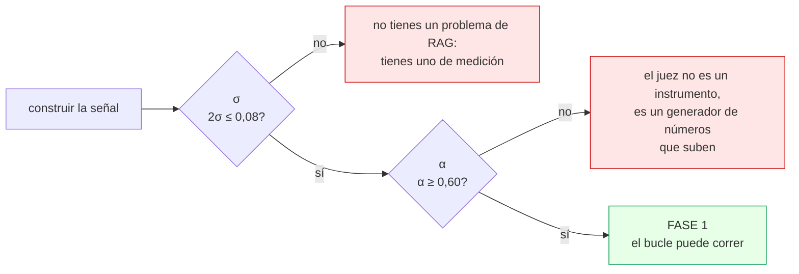
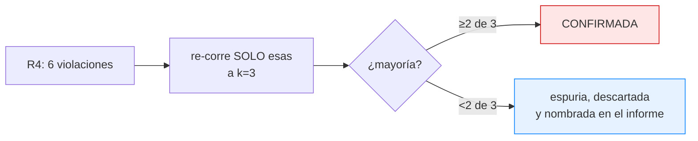
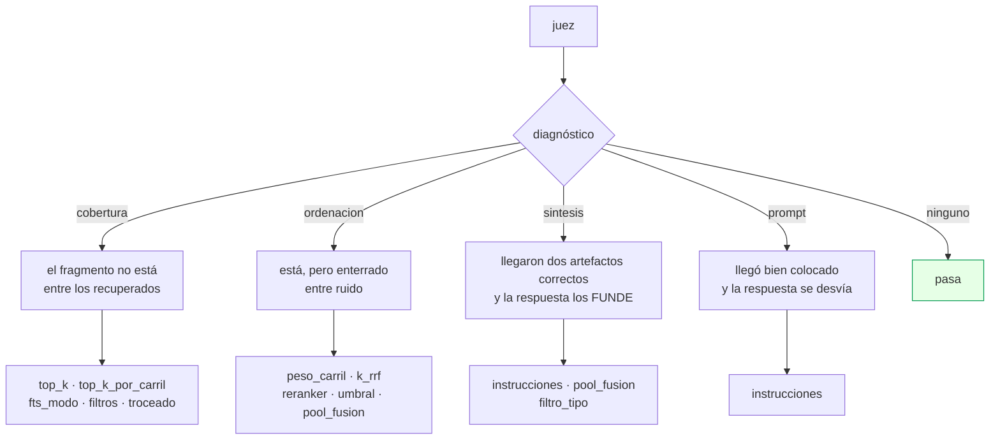
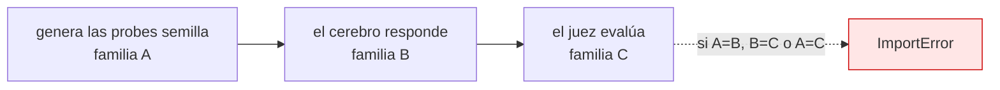
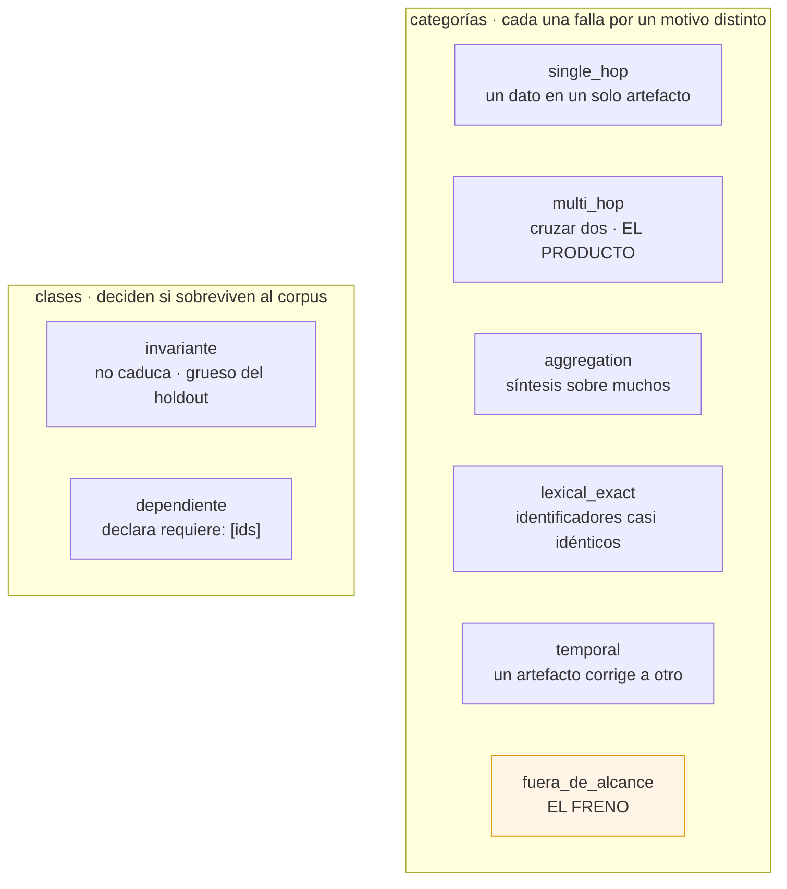
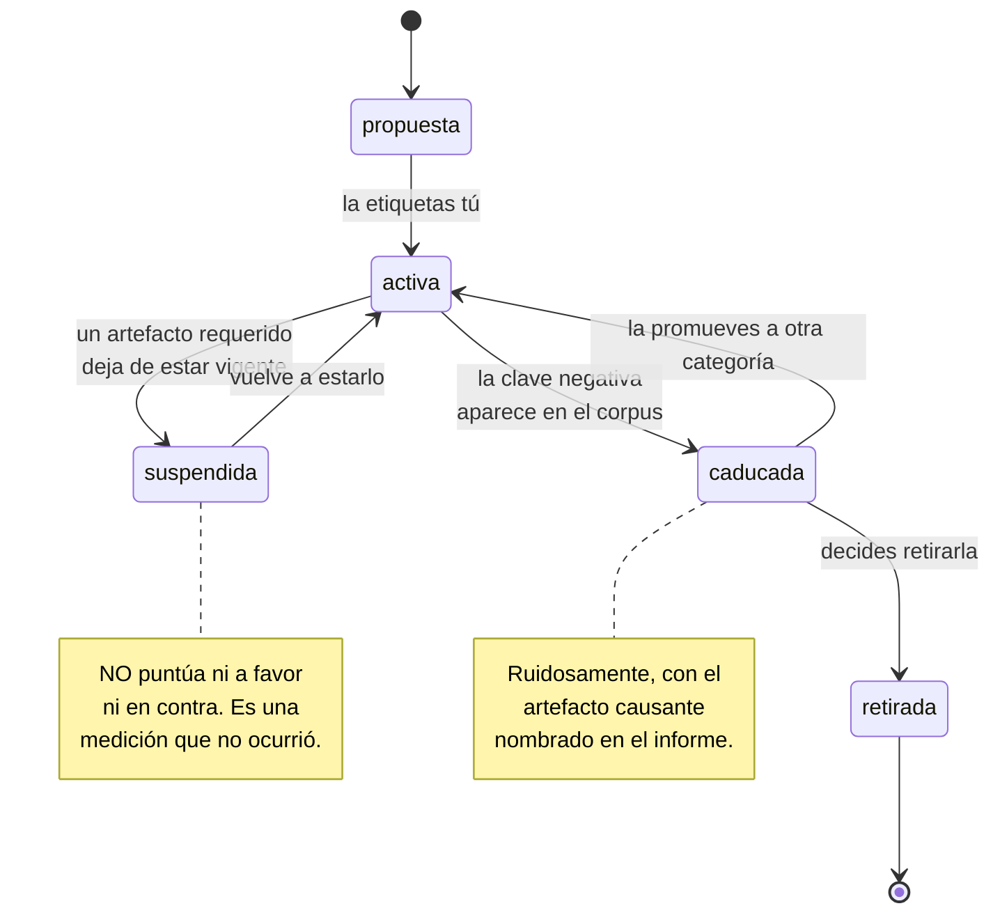
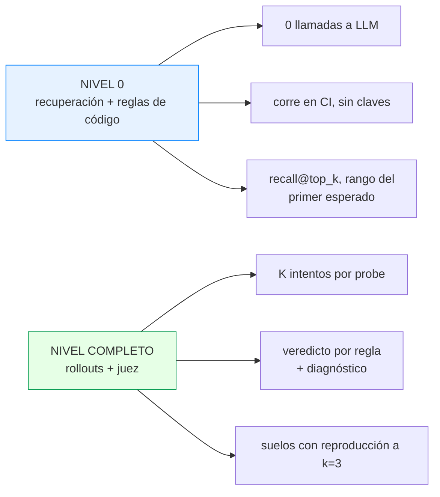
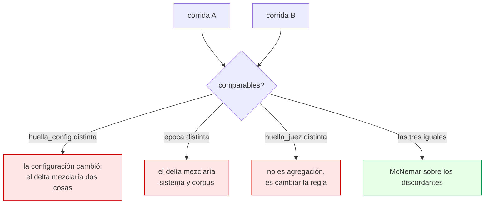
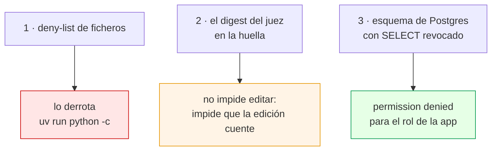

# La medición

Es la mitad del proyecto y la que casi nunca se construye. Un optimizador
brillante sobre una señal ruidosa produce un sistema que empeora mientras el
informe dice que mejora.

---

## Las dos puertas de la Fase 0



Las dos están implementadas y **las dos siguen sin pasarse**, porque ninguna se
puede medir contra un modelo guionizado: σ da 0,0000 por construcción y de un
juez determinista no hay nada que calibrar.

---

## La spec: ocho reglas

`cerebro/spec.md` es la función objetivo. El bucle no persigue «que responda
mejor»: persigue que cada regla se cumpla, medida sobre el golden set a una
época fija.

> Si una regla no se puede comprobar mecánicamente, no es una regla: es un
> deseo, y sale del documento.

| | Regla | Comprueba |
|---|---|---|
| **R1** | Toda afirmación cita su artefacto, en la forma `[[art:id]]` | código |
| **R2** | Si no está en el contexto, la frase literal «No lo tengo en la memoria.» | código |
| **R3** | Nunca memoria paramétrica del modelo | juez |
| **R4** | Los literales se reproducen literales: cifras, versiones, símbolos | código |
| **R5** | No fundir dos artefactos en una afirmación que ninguno sostiene | juez |
| **R6** | Lo superado se marca: da el vigente y nombra al que lo corrigió | juez |
| **R7** | El estatus epistémico se propaga | código |
| **R8** | Sin relleno. Empieza por el dato. Máximo ocho frases | código |

### Las reglas descartadas

Bloque obligatorio de la spec: es donde se ve que el criterio se aplicó de
verdad.

- *«La respuesta es accionable»* — exige criterio humano.
- *«Sugiere el artefacto relacionado más útil»* — «útil» no tiene línea
  comprobable sin un segundo juez, y un juez que juzga al juez es el escalón 6.
- *«No repite lo que ya sé»* — exigiría un modelo del estado de conocimiento del
  usuario que el sistema no tiene.

### R7, el estatus epistémico

Es la regla más específica de este dominio. Los artefactos declaran el estatus
de cada afirmación:

```yaml
afirmaciones:
  - texto: PgVector.create() no crea el índice HNSW ni el GIN.
    estado: probado
  - texto: A partir de 10^4 fragmentos el escaneo deja de ser aceptable.
    estado: extrapolacion
    verificable_por: EXPLAIN sobre una consulta de similitud
```

El estatus se indexa **dentro del texto**, no solo en los metadatos, para que la
regla sea comprobable contra los fragmentos recuperados y no contra una columna
que el juez no ve. Y una `extrapolacion` sin `verificable_por` se rechaza en
admisión: sin forma de comprobarla es una conjetura con otra etiqueta.

---

## Los suelos

Métrica primaria única, el resto como restricciones. **Nunca una suma
ponderada**: los pesos definen un tipo de cambio entre métricas y el optimizador
lo usará para maximizar el número sacrificando lo que querías proteger.

| Métrica | Suelo | Por qué |
|---|---|---|
| `recall@top_k` (**primaria**) | ≥ 0,85 | Si el fragmento no llega, no hay prompt que lo salve |
| **R4** · literales | **0 violaciones** | Aquí el fallo **se compone**: una versión mal citada entra en el siguiente artefacto que escribes y el corpus se autocontamina |
| **R2** · abstención | **0 fallos** | Inventar es peor que no responder |
| **R5** · no fusión | **0 violaciones** | Es el modo de fallo característico del producto |
| **R6** · lo superado | ≥ 0,95 | Conocimiento superado servido como vigente es la peor salida de una memoria viva |
| Latencia p95 | ≤ 8 s | Por encima dejas de usarlo, y así mueren las herramientas personales |

### Dos refinamientos que no son cosméticos

**1 · Los suelos que importan van en recuento, no en tasa.** Con n≈30 el
semiancho del intervalo de confianza al 95 % ronda ±16 puntos: un suelo de
«0,85» no es exigible porque el instrumento no lo distingue de 0,72. Cero
violaciones sí es exigible a cualquier n.

**2 · Una violación tiene que reproducirse.**



Supón un juez con un 95 % de auto-consistencia — es decir, que ante el mismo
caso repetido da el mismo veredicto 19 de cada 20 veces. **Esa cifra es un
supuesto ilustrativo, no una medición de este sistema**: α todavía no está
medida. Con ese supuesto y las 41 probes del golden set actual, la
probabilidad de al menos un veredicto espurio por corrida es
`1 − 0,95⁴¹ ≈ **88 %**`.

> Nótese que el número **empeora al crecer el conjunto**, y eso es correcto:
> más preguntas son más oportunidades de que el juez se equivoque en alguna.
> Es la razón por la que un suelo sin margen no escala sin reproducción.
Con un suelo de «cero violaciones», eso significa que **dos de cada tres
corridas bloquearían la promoción por un fantasma**, y el bucle gastaría
rondas persiguiéndolo. Coste de la defensa: tres llamadas por probe
sospechosa, no una corrida entera.

> El número exacto importa menos que su orden de magnitud: con cualquier juez
> realista y un suelo sin margen, las violaciones espurias son **lo normal**,
> no la excepción. Por eso el suelo se comprueba dos veces.

---

## El juez

Devuelve **un veredicto por regla y un diagnóstico**, no una nota.



Una nota agregada dice que algo va mal; un diagnóstico dice qué palanca tocar.
Es la diferencia entre «recall@5 = 0,3», que es un bit, y «el fragmento estaba
en el puesto 27 porque la consulta no llevaba el año», que es un plan de acción.

`sintesis` es propio de este sistema: aquí el fallo característico no es que el
fragmento no llegue, sino que **llegan dos artefactos correctos y el modelo los
funde en una afirmación que ninguno sostiene**.

> **`passed` se deriva en código, nunca se toma del modelo.** El esquema del juez
> podría llevar un campo «pasa» con la descripción «True solo si todas las reglas
> cumplen», pero eso es una instrucción, no una garantía, y la métrica que titula
> el informe no puede depender de que un modelo la respete.

### Los tres modelos disjuntos



Un `assert` en `config.py` revienta el import si dos coinciden. El
auto-reconocimiento **causa** la auto-preferencia: si el juez y el sistema
comparten modelo, el circuito se cierra sobre sí mismo y cada ronda confirma lo
que a ese modelo le gusta de sí mismo.

---

## El golden set

41 probes en seis categorías, más dos clases transversales.



**`fuera_de_alcance` es el freno.** Sin preguntas cuya respuesta no existe, el
bucle descubre pronto una estrategia ganadora trivial: recuperar cada vez más
contexto y responder siempre a todo. La nota sube, el sistema empeora, y nadie
se entera hasta que lo usas.

Por eso hay un **suelo de estrato**: si las activas de esa categoría bajan del
20 % del conjunto (mínimo 4), el arnés **se niega a correr**. No avisa: se
niega.

### Las tres fuentes de probes

1. **Semilla sintética**, anclada sobre el artefacto entero y no sobre el
   fragmento — si el generador muestrea pasajes con una estrategia de troceado,
   esa estrategia queda favorecida en el golden set resultante.
2. **Estratificación** en las seis categorías.
3. **Tráfico real promocionado** a caso permanente. **Aquí vive el trinquete**:
   el sistema no solo mejora, acumula inmunidad.

> **Prohibido:** filtrar las preguntas generadas por «que el retriever recupere
> el fragmento original». Garantiza recall@1 por construcción y convierte la
> métrica en una tautología.

### El ciclo de vida



**Una probe nunca se borra.** Se retira con motivo y fecha. Es la contramedida
directa a una suite que se podó de 918 tests a 165, de los que seis estaban
fallando y sus defectos siguen sin arreglar — solo sin asertar.

---

## Los dos niveles



**El nivel 0 solo mide lo comprobable sin respuesta.** Una probe de
`fuera_de_alcance` pregunta si el sistema se calla, y para eso hace falta que
hable; una probe sin `requiere` tiene recall trivialmente 1,0. Esas quedan
**fuera del denominador**: contarlas como fallo daría 15/41 cuando la cifra
honesta es 6/8.

---

## La identidad de corrida



No es un aviso: es una negativa, con el motivo escrito. Comparar de todos modos
daría un número que mezcla dos causas y no se puede atribuir a ninguna.

---

## Estadística

`evals/estadistica.py`. Sin numpy, sin scipy, sin frameworks.

| Función | Qué cierra |
|---|---|
| `ruido(corridas)` | σ entre corridas idénticas, más la **resolución del instrumento** (`1/n`). Umbral de aceptación: `max(2σ, 1/n)` |
| `descomponer_ruido(σ_total, σ_juez)` | σ_gen ≈ √(σ_total² − σ_juez²). **Si domina el juez, la ronda que ibas a gastar en `top_k` hay que gastarla en la rúbrica** |
| `mcnemar_exacto(b, c)` | p bilateral exacto sobre los discordantes |
| `vuelcos_minimos_detectables()` | El suelo honesto: **6 vuelcos netos** a α=0,05. Por debajo no hay nada detectable |
| `krippendorff_alpha(unidades)` | La puerta de la Fase 0. ~30 líneas |
| `bootstrap_ic(...)` | IC percentil remuestreando **unidades**, no decisiones |

### Por qué el bootstrap remuestrea casos y no decisiones

Las decisiones dentro de un mismo caso **no son independientes**: un caso mal
planteado arrastra sus tres reglas. Remuestrear decisiones estrecha el intervalo
de forma artificial — es la versión doméstica de la maldición del ganador.

### Y lo que NO está, con su motivo escrito

| | Condición de entrada |
|---|---|
| **Benjamini-Hochberg** | Controla el FDR entre muchas comparaciones. El protocolo es una palanca por ronda: no hay multiplicidad. **Entra el día que una sesión barra ≥12 configuraciones** |
| **CUPED** | Con n≈30 y resultados binarios produce un θ *confiadamente equivocado*, que es peor que no ajustar. **Entra a partir de ~150 probes y una métrica continua** |
| **Successive Halving / Hyperband** | Asignan presupuesto entre muchos candidatos. Con uno por ronda no hay problema de asignación |

Una caja de herramientas que no dice cuándo NO usarse invita a aplicarla donde
no toca.

---

## Calibración del juez

```
uv run rag calibrar --preparar     # 60 casos, en orden aleatorio, SIN el veredicto
uv run rag calibrar --comparar     # α global, α por regla, IC bootstrap
```

El veredicto del juez va codificado y la vista de etiquetado **no lo lee**:
verlo ancla, y una calibración anclada no mide nada.

| α | |
|---|---|
| ≥ 0,60 | adelante |
| 0,45 – 0,60 | **afinar**: mira las discrepancias por regla. Si una sola se lleva >50 %, reescribe SU línea comprobable — escalón 1, el más bajo que puede expresar el fallo |
| < 0,45 | bloquea |
| IC que cruza 0,60 con semiancho > 0,15 | **indeterminado**: 30 casos más antes de decidir |

**Etiqueta en dos tandas, no en una.** Una sesión larga se etiqueta peor al
final que al principio, y eso es ruido correlacionado con la posición — el peor
tipo.

### El techo no es 1,00

En la meta-evaluación de RAGChecker, el acuerdo entre anotadores **humanos**
sobre los mismos casos fue **70,09**.

Con un solo anotador no hay techo inter-anotador. El sustituto honesto es el
**techo intra**: re-etiquetar 20 casos a ciegas siete días después. Y la lectura
importa — **si α_intra < 0,70, lo roto es la rúbrica, no el juez**. Es un
diagnóstico distinto y lleva a una acción distinta, así que confundirlos cuesta
semanas de cambiar de modelo sin arreglar nada.

---

## El holdout

Tres capas, y solo la tercera aísla.



El rol de la aplicación **es dueño** del esquema de trabajo: ingiere, indexa y
migra sin pedir permiso. La frontera no está ahí. Darle solo permisos de datos
obligaría a correr la ingesta con la credencial del dueño, y entonces esa
credencial estaría en el camino habitual — **una barrera que estorba en el día a
día se acaba desactivando**.

Y puede escribir en el registro de accesos pero no borrar lo que escribió: un
holdout que se consulta sin dejar rastro ya está quemado.

**Se mira una vez, al cerrar la sesión, y su resultado informa — no decide.** Si
lo usas para elegir la siguiente palanca deja de ser un conjunto no visto y
pierdes la única defensa que tienes contra estar optimizando ruido.

---

## Qué falta para cerrar la Fase 0

```
[x] `rag up` funciona en un clon limpio SIN ninguna clave de API
[ ] ≥30 probes activas, ≥5 por categoría          <- hay 41, y ≥3 por categoría
[x] ≥12 probes invariantes
[x] Holdout inaccesible desde el rol de la aplicación
[x] Épocas estampadas y el filtro verificado
[x] Las tres huellas en cada informe, y la negativa probada con un test
[~] σ: el mecanismo funciona; falta medirla contra un modelo real
[ ] α ≥ 0,60 sobre ≥50 casos, con α por regla y su IC bootstrap
[x] Los asserts de gradas, tres-modelos-disjuntos y censura-doble, pasando
[x] Registro de tráfico real con voto capturando el 100 % de las consultas
[x] Los suelos implementados como código que hace fallar la corrida
[x] Reproducción a k=3 de cualquier violación de suelo
```

**El criterio transversal es una puerta, no un consejo.** Si 2σ > 0,08 después
de todo esto, no se avanza: automatizar encima de una medición rota solo acelera
el desastre.
