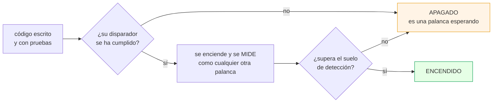
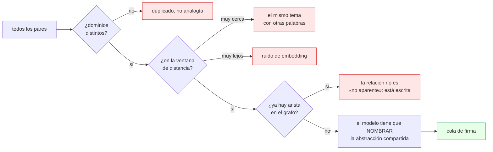

# Fases 2, 3 y 4 — construidas y apagadas

> Antes de leer esto conviene haber pasado por [00 · El problema](00-el-problema.md).
> Si tropiezas con una palabra, está en el [glosario](99-glosario.md).

Este documento cubre todo lo que el plan original dejaba **diseñado y sin
construir**. Ahora está construido, probado y medido. Y sigue **apagado**.

## Por qué construido y apagado no es una contradicción

La doctrina de este proyecto dice que se avanza de fase por una puerta con
umbral duro, y que la puerta 0 → 1 son dos números que todavía no se han medido
—α ≥ 0,60 y 2σ ≤ 0,08—. Construir la fase 3 antes de pasar esa puerta parece
saltársela.

No lo es, porque la puerta controla **qué mueve el bucle solo**, no **qué código
existe**. Son dos preguntas distintas y confundirlas tiene un coste concreto:

- Si esperas a la puerta para *escribir* el carril de grafo, el día que
  `multi_hop` caiga tienes que parar y construirlo, y esa parada dura una semana.
- Si lo escribes antes y lo dejas apagado, ese día es **una palanca**.

Lo que no puede pasar —y es lo que el resto de este documento intenta impedir—
es que «construido» se lea como «probado que sirve». Cada pieza de aquí llega
con su medición, y varias de esas mediciones dicen *todavía no*.



---

## Fase 2 · Contexto

### Reescritura de consulta

`cerebro/reescritura.py`. Tres modos y un reparto que es el punto entero:

| modo | llamadas | qué hace |
|---|---|---|
| `expansion` | 0 | añade sinónimos del dominio a la consulta **léxica** |
| `hyde` | 1 | escribe la nota que respondería, y busca con ella |
| `hyde_lexico` | 1 | señuelo para el denso, literal para el léxico |

**HyDE** —*Hypothetical Document Embeddings*, Gao et al. 2022— suena raro y
funciona por un motivo concreto: una pregunta y una respuesta viven en zonas
distintas del espacio de embeddings, y tu corpus está lleno de respuestas.
Buscar una respuesta *con* una respuesta acorta la distancia.

Su defecto conocido es que la nota inventada **puede alucinar términos**, y en
un corpus pequeño eso arrastra la búsqueda a sitios que no existen. Por eso la
consulta original sobrevive siempre dentro del señuelo: si el modelo se inventa
algo, el término real sigue ahí como ancla.

Y `hyde_lexico` es el modo que respeta lo que cada carril hace bien. El denso
quiere prosa; el léxico quiere el símbolo exacto que escribiste, y una nota
generada por un modelo casi nunca lo contiene.

> **Un defecto que encontró su propio test.** La primera versión de la expansión
> solo casaba formas exactas, así que «fragmentos» no encontraba «fragmento» y
> la tabla de sinónimos casi no disparaba: una palanca que parecía encendida y
> no lo estaba. El arreglo es una raíz burda que quita el plural castellano —no
> un lematizador, que sería una dependencia y un modelo para quitar una `s`.

### Enrutado

`cerebro/enrutador.py`. **Por reglas escritas a mano, no con un modelo**, y los
tres motivos importan:

1. **Cero latencia y cero coste.** Un clasificador LLM añadiría una llamada a
   cada consulta para decidir algo que una expresión regular acierta.
2. **Es auditable.** La regla que disparó viaja en la traza, así que cuando se
   equivoque se verá cuál fue.
3. **Es reversible sin reindexar.** Grada 2: el bucle puede moverla.

Cinco reglas, y cada una ajusta lo que esa forma de pregunta necesita:

| regla | qué detecta | qué cambia |
|---|---|---|
| `agregacion` | «¿qué he aprendido sobre…?» | dobla `top_k`, pesa el denso |
| `temporal` | «¿sigue vigente…?» | **apaga `solo_vigentes`** |
| `multi_hop` | «¿qué relación hay entre…?» | pesa el grafo, amplía `top_k` |
| `lexico_exacto` | dos o más símbolos literales | pesa el léxico, `fts_modo=and` |
| `por_defecto` | nada de lo anterior | la configuración base |

La de `temporal` es la interesante: R6 pide **nombrar** el artefacto que superó
a otro, y para nombrarlo hay que poder verlo. Con `solo_vigentes` puesto, el
superado no llega y la regla es imposible de cumplir por construcción.

> **El fallo característico del enrutado**, dicho por delante: una regla que
> dispara casi siempre equivale a cambiar el valor por defecto, y una que no
> dispara nunca es código muerto. Por eso `estadisticas()` cuenta los disparos
> sobre el tráfico real y señala las dos patologías.

### Aprendizaje

`cerebro/aprendizaje.py`. Dos de los seis almacenes de Agno —`LearnedKnowledge`
en modo `AGENTIC` y `DecisionLog`— y el motivo de cada exclusión está escrito.

Lo importante: **lo aprendido nunca se cita en una respuesta.** Si lo hiciera,
R1 —«toda afirmación cita su artefacto»— dejaría de ser comprobable, porque
habría afirmaciones cuyo origen es una memoria interna que nadie escribió.

Y `run_rollouts` corta las escrituras de learning durante los evals, de forma
incondicional. O sea que el sistema **no aprende de medirse**, que es un fallo
que en un arnés escrito a mano se cuela sin que nadie lo note — y produce la
mejora más satisfactoria y más falsa que existe.

---

## Fase 3 · Esquema

### El grafo

`cerebro/grafo.py`. Dos tablas, no un motor de grafos. Cinco clases de arista, y
el orden importa porque las tres primeras son **hechos** y las dos últimas
**inferencias**:

| clase | peso | procedencia |
|---|---|---|
| `supera` | 3,0 | una persona firmó que este corrige a aquel |
| `relacionado` | 2,0 | está en el frontmatter |
| `cita` | 2,0 | el cuerpo nombra el id del otro |
| `tema_compartido` | ~IDF | coincidencia de vocabulario |
| `dominio_compartido` | ~IDF | idem |
| `co_recuperado` | 1,0 | el tráfico real los trajo juntos, **con pulgar arriba** |

Las dos derivadas se pesan por **rareza**, no por presencia: compartir un tema
que tienen once de trece artefactos no dice nada; compartir uno que solo tienen
dos es casi una declaración. Sin esto, un corpus monotemático —que es lo que es
un corpus personal al principio— sale como un grafo casi completo.

Y `co_recuperado` solo cuenta con voto positivo: sin ese filtro, la
co-recuperación mide lo que el sistema *hace* y no lo que *acierta*, y el grafo
aprendería sus propios sesgos.

**El carril** es PageRank personalizado, sembrado con lo que el denso encontró.
No busca: amplía. `alfa` es la palanca que decide cuánto se aleja el paseo —
alto se queda en las semillas, bajo se va al centro del grafo y devuelve siempre
lo popular, que es la degeneración clásica de este carril.

> **Su medición, y por qué sigue apagado.** Encendido, el nivel 0 pasa de 15/27
> a 16/27 y el recall de 0,85 a 0,89. Pero `multi_hop` —la categoría que existe
> para arreglar— **baja** de 3/7 a 2/7. El diff cuenta 4 peor y 5 mejor: nueve
> vuelcos brutos, uno neto, y el suelo de detección son seis. La respuesta
> correcta es **no se puede saber**, y el disparador sigue en pie. Está contado
> entero en [su artefacto](../artefactos/corpus/2026/el-carril-de-grafo-construido-y-sin-encender.md).

### Comunidades

`cerebro/comunidades.py`. **Propagación de etiquetas, no Leiden**: Leiden es
mejor y necesita `igraph` + `leidenalg`, dos dependencias binarias para
particionar trescientos nodos.

Su defecto conocido —particiones inestables en grafos poco densos— se ataca por
dos lados. El orden de recorrido está fijado y los empates se rompen por la
etiqueta menor, así que **el resultado es reproducible**; una comunidad que
cambia entre dos corridas idénticas no se puede usar para medir nada. Y la
modularidad se reporta siempre: por debajo de 0,30 el informe dice que la
partición no significa nada en vez de dibujar comunidades bonitas sobre ruido.

Para qué sirven: para las preguntas de `aggregation`. *«¿Qué he aprendido sobre
medir con pocas muestras?»* no tiene un fragmento que la responda, tiene doce.
Servir **el resumen de la comunidad** devuelve una respuesta; servir los doce
fragmentos devuelve una lista y gasta el contexto.

Es la idea de GraphRAG con dos diferencias: se construye sobre un grafo de
artefactos y no de entidades extraídas —así que no cuesta una llamada por
documento para poblarlo— y el resumen cuesta **una llamada por comunidad**, no
por documento. Con una docena de comunidades son doce llamadas al mes.

### Analogías cross-dominio

`cerebro/analogias.py`. Es la pieza del requisito titular —«relacionar contextos
dispares, autodescubrir relaciones no aparentes»— y llega la última porque
**proponer analogías es fácil y evaluarlas es muy difícil**.

El único juez posible eres tú, una por una. Un sistema que propone sin criterio
de admisión produce una lista que crece más rápido de lo que la revisas, y eso
es la definición de ruido. Tres filtros baratos antes de gastar un modelo:



El modelo **no decide si se parecen** —eso ya lo decidió la distancia—: decide
si hay una abstracción que se pueda **nombrar en una frase**, y tiene que
escribirla. «Los dos hablan de fallos» no vale. «Los dos son un parámetro que se
lee como vivo y no lo está» sí, porque es comprobable contra los dos artefactos.

> **Y aquí un límite duro que conviene saber:** con el embedder determinista
> esto **no puede funcionar**. Los vectores de SHA-256 son casi ortogonales, así
> que toda distancia ronda 1,0 por construcción. No es que no encuentre
> analogías: es que la pregunta no se puede formular. `rag analogias` lo dice
> con esas palabras, porque la primera versión sugería que «el corpus es pequeño
> o los dominios están muy separados» — un motivo plausible, equivocado, y que
> te manda a arreglar lo que no está roto.

---

## Fase 4 · Topología

`cerebro/topologia.py`. Es la fase que el plan marcaba como «probablemente
nunca», y conviene decir qué es y qué no.

**No sirve para responder preguntas.** No hay carril de topología, no entra en
la fusión, no toca el prompt. Si mañana se borrara, ninguna probe cambiaría.

Sirve para la única pregunta que un corpus puede contestar y un documento no:
**¿en qué está cambiando mi investigación?**

| medida | qué se lee |
|---|---|
| **puentes** | artefactos cuya invalidación partiría el corpus en dos |
| **agujeros** | pares de comunidades sin ninguna arista: donde una analogía valdría más |
| **deriva** | qué apareció, qué llegó aislado, qué dejó de ser puente |

Los agujeros son el concepto de Burt sobre huecos estructurales, aplicado a tus
propias notas. Y la deriva devuelve `None` —no cero— la primera vez: «no hay
cambio» y «no hay con qué comparar» son cosas distintas, y confundirlas es el
error habitual de cualquier panel de métricas.

Coste: **cero llamadas a modelo**. Es todo aritmética sobre el grafo.

---

## Estado del arte que estaba diferido

### Los tres barridos

`evals/estadistica.py`. Las tres estuvieron ausentes con su motivo escrito
mientras el protocolo era «una palanca por ronda». Ahora existen, y **la nota de
por qué no se usaban se conserva convertida en su condición de entrada**: cada
una la comprueba y se niega cuando no se cumple.

- **Benjamini-Hochberg.** Con seis candidatos y sin corregir, la probabilidad de
  que uno parezca bueno por azar ronda el 26 %. Bonferroni pasa de frenada; BH
  controla la fracción esperada de falsos entre los rechazados.
- **CUPED.** Se niega con n < 150 y con métricas binarias, y dice cuál de las
  dos. Con n pequeño, θ sale *confiadamente equivocado* y ajustar con él
  **aumenta** la varianza mientras el número parece más limpio.
- **Successive halving.** Su primera ronda nunca baja del suelo de detección:
  descartar con menos probes de las que hacen falta para distinguir algo no es
  descartar, es sortear.

### GEPA

`evals/gepa.py`. Evolución de instrucciones por reflexión sobre los fallos.
Llega con la puerta más exigente del repositorio y **hoy está cerrada**:

```console
$ uv run rag gepa
  probes  41 / 120
  α       sin medir / 0.7

  la puerta está CERRADA:
    · 41 probes, hacen falta 120…
    · α no está medida. Sin calibrar el juez, GEPA optimiza el sesgo del juez…
    · 41/41 probes son sintéticas…
```

Tres cosas la hacen peligrosa aquí, y las tres tienen su contramedida:

1. `instrucciones` es una palanca de **generación**, y un golden set sintético
   no las ordena bien. → **GEPA propone y no aplica.** Escribe en la cola y la
   firmas tú. Nunca toca `config.py`.
2. Es un **barrido**, no una palanca por ronda. → la comparación usa BH.
3. **Sobreajusta por construcción**: está leyendo las respuestas del examen. →
   la propuesta lleva escrito que está sobreajustada y que el holdout está sin
   verificar.

### La cola de firma

`uv run rag propuestas`. Una sola cola para cuatro clases —analogía, arista,
probe, instrucción— porque el acto es el mismo: mirar algo diez segundos y
firmarlo o no. Cuatro colas serían cuatro sitios donde mirar, y en dos semanas
nadie mira ninguno.

**Un rechazo exige motivo**, y el comando se niega sin él. Es el dato más caro
que produces aquí —exige que una persona piense— y el primero que se pierde.
Cien rechazos con motivo son un conjunto de entrenamiento para ajustar la
ventana de las analogías con datos; cien sin motivo son un contador.

### Los trabajos periódicos

`uv run rag jobs --nocturno` y `--mensual`. Van al planificador del sistema, **no
al scheduler de AgentOS**, y es una decisión: el scheduler de AgentOS vive
dentro del proceso del servidor, así que solo corre si el servidor está
levantado — y un portátil personal no lo está de noche. Un job que depende de
que un proceso esté vivo para hacer su trabajo periódico es un job que no corre,
y peor, uno que *parece* configurado.

El nocturno no gasta ni una llamada: reconstruye el grafo, detecta comunidades,
mide la topología y avisa de dos cosas que si no se pierden — artefactos nuevos
que llegaron **aislados**, y consultas con pulgar abajo **sin minar**.

---

## El resumen honesto de las tres fases

| pieza | construida | probada | encendida | por qué |
|---|:---:|:---:|:---:|---|
| reescritura | sí | sí | **no** | disparador: `single_hop` fallando por formulación |
| enrutado | sí | sí | **no** | grada 2, sin medición que lo justifique |
| aprendizaje | sí | — | **no** | cambia el turno; hace falta medirlo antes |
| grafo + PPR | sí | sí | **no** | medido: no se puede saber si aporta |
| comunidades | sí | sí | **no** | disparador: `aggregation` < 0,60 por recall — hoy **no evaluable**: 4 probes y el umbral cae entre dos valores posibles |
| analogías | sí | — | **no** | necesita embedder real; con el mock no se formula |
| topología | sí | sí | **sí** | no toca ninguna respuesta: no hay nada que apagar |
| BH · CUPED · halving | sí | sí | condicional | se niegan solos fuera de régimen |
| GEPA | sí | — | **no** | puerta cerrada por tres motivos citados |

Siete de nueve apagadas. Eso no es un proyecto a medias: es lo que pasa cuando
la decisión de encender depende de una medición y la medición todavía no dice
que sí.
